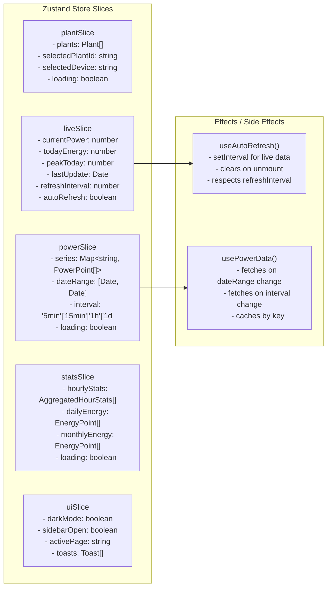
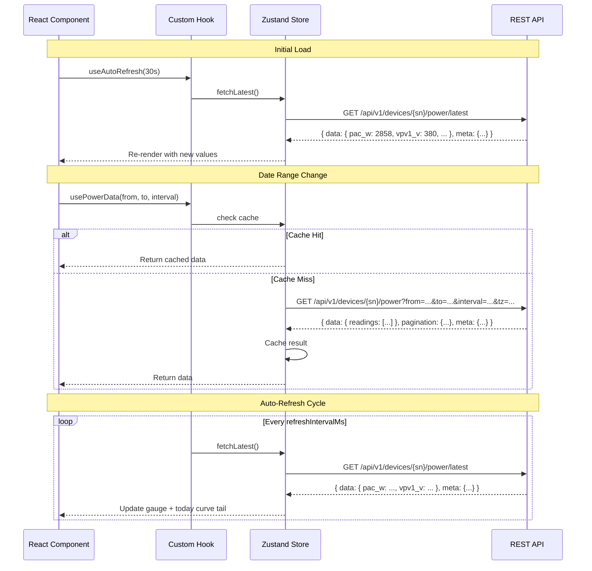

# GoGrowatt Web Frontend Design

## 1. Data Analysis & Domain Understanding

### 1.1 Observed Data Characteristics

Analysis of the CSV files in `/data/` and the Go types in `pkg/growatt/types.go` reveals the following data shape:

**5-Minute Power Readings** (`power_*.csv`):
```
date,time,power_watts
2026-02-14,12:56,2729.50    <-- ~2.7 kW (one string)
2026-02-14,13:01,5170.90    <-- ~5.2 kW (both strings) -- PRODUCTION DOUBLING
```

- Readings arrive at ~5-minute intervals (`:05`, `:10`, `:16`, `:21`, etc.)
- Not perfectly aligned to 5-minute boundaries (drift of 1-4 minutes is normal)
- Power values are floats in watts, range 0 to ~6000 W for this system
- Production window is roughly 07:00-19:00 (latitude-dependent)
- A dramatic ~2x production jump occurs around 12:55-13:00 every day (second string of panels catching the sun)
- Data starts mid-day on Feb 12 (first collection), suggesting the system was installed or polling began then

**Hourly Aggregates** (`hourly_*.csv`):
```
date,hour,min_watts,max_watts,avg_watts,samples
2026-02-14,12,2561.50,5223.30,2904.87,12
2026-02-14,13,4837.80,5195.30,5067.06,12
```

- 24 hours per day, many with zero samples (nighttime)
- `samples` count indicates 12 readings/hour (5-min intervals)
- The hour-12 row shows large min/max spread when the production doubling occurs mid-hour

**Per-String Inverter Data** (`MINInverterData` / `MINHistoryDataPoint`):
- `vpv1_v`, `vpv2_v`: PV string voltages (V)
- `ipv1_a`, `ipv2_a`: PV string currents (A)
- `pac_w`: AC output power (W)
- `ppv_w`: DC PV input power (W)
- `vac1_v`, `iac1_a`: Grid voltage and current
- `temperature_c`: Inverter temperature
- `frequency_hz`: Grid frequency (Hz)

**Energy Data** (`EnergyDataPoint`):
- `date` + `energy_kwh` (kWh), available at daily or monthly granularity

**Plant-Level Summary** (`PlantData`):
- `current_power_w`, `today_energy_kwh`, `total_energy_kwh`, `peak_power_today_w`
- `month_energy_kwh`, `year_energy_kwh`

### 1.2 Key Patterns Worth Visualizing

| Pattern | Description | Visualization |
|---------|-------------|---------------|
| **Production Doubling** | ~13:00 jump from ~2.7 kW to ~5.2 kW as second string activates | Annotated step in power curve |
| **Morning Ramp** | Gradual 07:00-10:00 increase (0 -> ~2 kW) | Smooth curve with slope indicator |
| **Evening Tail** | 17:00-19:00 slow decay to zero | Curve tapering to baseline |
| **Intra-Hour Variance** | Cloud transients cause 500-1000 W swings within an hour | Min/max ribbon overlay |
| **Day-to-Day Consistency** | Feb 12 vs Feb 14 show similar profiles; Feb 13 had clouds (14:00 dip to 599W) | Multi-day overlay comparison |
| **String Imbalance** | vpv1_v/ipv1_a vs vpv2_v/ipv2_a reveals which string produces at which hours | Dual-axis or stacked area chart |
| **Peak Hour** | Consistently 13:00 across all sampled days (~5 kW avg) | Highlighted bar in hourly chart |

---

## 2. Technology Stack

| Layer | Choice | Rationale |
|-------|--------|-----------|
| Framework | **React 18** (with hooks) | Component model fits dashboard widgets; large ecosystem |
| Build | **Vite** | Fast HMR, ESBuild-based, Go-friendly static output |
| Charts | **Apache ECharts 5** | Rich chart types (heatmap, boxplot, gauge, candlestick), built-in zoom/pan, good large-dataset performance |
| Styling | **Tailwind CSS 3** | Utility-first, easy dark mode via `dark:` prefix, responsive breakpoints |
| State | **Zustand** | Lightweight, no boilerplate, supports subscriptions for auto-refresh |
| HTTP | **fetch** + custom hooks | Thin abstraction, no heavy library needed for read-only API |
| Date handling | **date-fns** | Tree-shakable, no Moment.js weight |
| Router | **React Router v6** | Standard SPA routing |
| Export | **Client-side CSV generation** | No server dependency for exports |

---

## 3. Component Hierarchy

```mermaid
graph TD
    App["App (Router + ThemeProvider + StoreProvider)"]

    App --> Layout["Layout (Shell)"]
    Layout --> Sidebar["Sidebar / Nav"]
    Layout --> TopBar["TopBar (plant selector, refresh toggle, dark mode)"]
    Layout --> PageSlot["Page Slot (router outlet)"]

    PageSlot --> Dashboard["DashboardPage"]
    PageSlot --> Historical["HistoricalPage"]
    PageSlot --> Comparison["ComparisonPage"]
    PageSlot --> Statistics["StatisticsPage"]
    PageSlot --> DeviceDetail["DeviceDetailPage"]

    Dashboard --> LiveGauge["LivePowerGauge"]
    Dashboard --> TodayCurve["TodayPowerCurve"]
    Dashboard --> SummaryCards["SummaryCards (today kWh, total, peak)"]
    Dashboard --> MiniCalendar["MiniEnergyCalendar"]

    Historical --> DateRangePicker["DateRangePicker"]
    Historical --> IntervalSelector["IntervalSelector (5m/15m/1h/1d)"]
    Historical --> PowerTimeSeries["PowerTimeSeriesChart"]
    Historical --> EnergyBars["EnergyBarChart"]

    Comparison --> DayPicker["MultiDayPicker"]
    Comparison --> OverlayChart["OverlayTimeChart"]
    Comparison --> DiffTable["DifferenceTable"]

    Statistics --> HeatmapChart["HourlyHeatmap"]
    Statistics --> BoxPlotChart["HourlyBoxPlots"]
    Statistics --> MonthlyBars["MonthlyEnergyBars"]
    Statistics --> StatsTable["StatsSummaryTable"]

    DeviceDetail --> InverterInfo["InverterInfoCard"]
    DeviceDetail --> StringChart["StringVoltageCurrentChart"]
    DeviceDetail --> GridChart["GridVacIacChart"]
    DeviceDetail --> TempChart["TemperatureChart"]

    subgraph "Shared Components"
        ChartWrapper["ChartWrapper (ECharts container + export + loading)"]
        ExportButton["ExportCSVButton"]
        RefreshIndicator["RefreshIndicator"]
        ErrorBoundary["ErrorBoundary"]
        EmptyState["EmptyState"]
        LoadingSkeleton["LoadingSkeleton"]
    end

    PowerTimeSeries --> ChartWrapper
    OverlayChart --> ChartWrapper
    HeatmapChart --> ChartWrapper
    BoxPlotChart --> ChartWrapper
    LiveGauge --> ChartWrapper
    TodayCurve --> ChartWrapper
    StringChart --> ChartWrapper
    EnergyBars --> ChartWrapper
    MonthlyBars --> ChartWrapper
    ChartWrapper --> ExportButton
```



---

## 4. Page Layouts & Data Flow

### 4.1 Dashboard Page

```
+------------------------------------------------------------------+
| TopBar: [Plant Selector v] [Auto-refresh: 30s v] [Dark Mode]    |
+--------+---------------------------------------------------------+
| Sidebar|  +---------------+  +---------------+  +--------------+ |
|        |  | CURRENT POWER |  | TODAY ENERGY  |  |  PEAK TODAY  | |
| Dash   |  |   2,858 W     |  |   12.4 kWh    |  |   5,223 W    | |
| History|  |  [gauge viz]  |  | [progress bar]|  |  at 13:00    | |
| Compare|  +---------------+  +---------------+  +--------------+ |
| Stats  |                                                         |
| Device |  +----------------------------------------------------+ |
|        |  |            TODAY'S POWER CURVE                      | |
|        |  |  5k W |         ____                               | |
|        |  |       |    ____/    \____                           | |
|        |  |  2.5k |___/              \___                      | |
|        |  |       |                      \___                  | |
|        |  |    0  +--+--+--+--+--+--+--+--+--+-->             | |
|        |  |       07 08 09 10 11 12 13 14 15 16 17 18         | |
|        |  +----------------------------------------------------+ |
|        |                                                         |
|        |  +------------------------+ +------------------------+  |
|        |  | WEEK ENERGY BARS       | | MINI HEATMAP (7 days)  |  |
|        |  |  [daily bar chart]     | | [hour x day color grid]|  |
|        |  +------------------------+ +------------------------+  |
+--------+---------------------------------------------------------+
```

**Data flow:**
1. On mount: `GET /api/v1/plants` to populate plant selector
2. On plant select: `GET /api/v1/plants/{id}` for summary data (`today_energy_kwh`, `total_energy_kwh`)
3. Auto-refresh timer: `GET /api/v1/devices/{sn}/power/latest` every N seconds for gauge
4. Background: `GET /api/v1/devices/{sn}/power?from=today&to=today&interval=5min` for today's curve
5. Background: `GET /api/v1/devices/{sn}/energy?from=7d_ago&to=today&unit=day` for week bars

### 4.2 Historical Page

```
+------------------------------------------------------------------+
| TopBar                                                            |
+--------+---------------------------------------------------------+
| Sidebar|  [Date Range: 2026-02-01 to 2026-02-15]                |
|        |  [Interval: (5min) (15min) (1h) (1d)]                   |
|        |                                                         |
|        |  +----------------------------------------------------+ |
|        |  |  POWER TIME SERIES (zoomable, pannable)            | |
|        |  |                                                    | |
|        |  |  [ECharts dataZoom slider at bottom]               | |
|        |  |  [tooltip with exact time + value on hover]        | |
|        |  |  [brush select to zoom]                            | |
|        |  |                                                    | |
|        |  |                          [Export CSV]              | |
|        |  +----------------------------------------------------+ |
|        |                                                         |
|        |  +----------------------------------------------------+ |
|        |  |  ENERGY ACCUMULATION (bar or area)                 | |
|        |  |  [daily kWh bars with cumulative line overlay]     | |
|        |  +----------------------------------------------------+ |
+--------+---------------------------------------------------------+
```

**Data flow:**
1. User selects date range and interval
2. `GET /api/v1/devices/{sn}/power?from=...&to=...&interval=...&tz=...`
3. For energy view: `GET /api/v1/devices/{sn}/energy?from=...&to=...&unit=day&tz=...`
4. ECharts `dataZoom` component handles client-side zoom/pan (no re-fetch needed for zoom)
5. Interval change triggers new API call with different aggregation

### 4.3 Comparison Page

```
+------------------------------------------------------------------+
| TopBar                                                            |
+--------+---------------------------------------------------------+
| Sidebar|  [Select days to compare: +Add Day]                    |
|        |  [x] Feb 12  [color: blue]                             |
|        |  [x] Feb 13  [color: orange]                           |
|        |  [x] Feb 14  [color: green]                            |
|        |  [x] Feb 15  [color: red]                              |
|        |                                                         |
|        |  +----------------------------------------------------+ |
|        |  |  OVERLAY CHART (shared time axis 00:00-23:59)      | |
|        |  |                                                    | |
|        |  |  5k |     ,--green--,    ,--blue---,               | |
|        |  |     |    / orange  / \  / \         \              | |
|        |  |  2.5|---/  ___/  /   \/   \  red    \---           | |
|        |  |     |              cloud dip (Feb 13)              | |
|        |  |   0 +--+--+--+--+--+--+--+--+--+--+-->            | |
|        |  |     07 08 09 10 11 12 13 14 15 16 17 18            | |
|        |  |                                                    | |
|        |  |  [Annotation: "~13:00 production doubling"]        | |
|        |  +----------------------------------------------------+ |
|        |                                                         |
|        |  +----------------------------------------------------+ |
|        |  |  DIFFERENCE TABLE                                  | |
|        |  |  Day   | Peak W | Total kWh | Peak Hour | Notes   | |
|        |  |  Feb12 | 5,404  |  17.5     | 13:00     | Clear   | |
|        |  |  Feb13 | 6,007  |  17.6     | 13:00     | Clouds  | |
|        |  |  Feb14 | 5,223  |  20.4     | 13:00     | Clear   | |
|        |  +----------------------------------------------------+ |
+--------+---------------------------------------------------------+
```

**Data flow:**
1. User adds dates via picker (up to 7 days recommended)
2. For each date: `GET /api/v1/devices/{sn}/power?from={date}&to={date}&interval=5min&tz=...`
3. Client normalizes all series to shared time-of-day x-axis (strips date, keeps HH:MM)
4. ECharts renders N series overlaid with distinct colors and legends

### 4.4 Statistics Page

```
+------------------------------------------------------------------+
| TopBar                                                            |
+--------+---------------------------------------------------------+
| Sidebar|  [Period: 2026-02-01 to 2026-02-15]                    |
|        |                                                         |
|        |  +----------------------------------------------------+ |
|        |  |  HOURLY HEATMAP                                    | |
|        |  |  (rows=days, cols=hours, color=avg watts)          | |
|        |  |        07 08 09 10 11 12 13 14 15 16 17 18         | |
|        |  |  Feb12       [] [] [] ## ## ## [] [] []             | |
|        |  |  Feb13       [] [] [] ## .. ## [] [] []             | |
|        |  |  Feb14       [] [] [] ## ## ## [] [] []             | |
|        |  |  Feb15  [] [] [] [] [] ##                           | |
|        |  |  (## = high power, [] = medium, .. = cloud dip)    | |
|        |  +----------------------------------------------------+ |
|        |                                                         |
|        |  +------------------------+ +------------------------+  |
|        |  | HOURLY BOX PLOTS       | | DAILY ENERGY BARS      |  |
|        |  | (hour on x-axis,       | | (date on x-axis,       |  |
|        |  |  box=quartiles of      | |  bar height = kWh,     |  |
|        |  |  avg power across days)| |  color by weekday)     |  |
|        |  +------------------------+ +------------------------+  |
|        |                                                         |
|        |  +----------------------------------------------------+ |
|        |  |  MONTHLY ENERGY BAR CHART                          | |
|        |  |  [stacked or grouped by month]                     | |
|        |  +----------------------------------------------------+ |
|        |                                                         |
|        |  +----------------------------------------------------+ |
|        |  |  STATS SUMMARY TABLE                               | |
|        |  |  Hour | Min | Max | Avg | Median | StdDev | Days   | |
|        |  |  ...matching the stats_*.md format...              | |
|        |  +----------------------------------------------------+ |
+--------+---------------------------------------------------------+
```

**Data flow:**
1. `GET /api/v1/devices/{sn}/stats?from=...&to=...&tz=...` for hourly aggregates
2. `GET /api/v1/devices/{sn}/energy?from=...&to=...&unit=day&tz=...` for daily bars
3. `GET /api/v1/devices/{sn}/energy?from=...&to=...&unit=month&tz=...` for monthly bars
4. Stats endpoint returns `MultiDayStats`-shaped JSON (`by_hour` array with `min_w`/`max_w`/`avg_w`/`median_w`/`stddev_w`)

### 4.5 Device Detail Page

```
+------------------------------------------------------------------+
| TopBar                                                            |
+--------+---------------------------------------------------------+
| Sidebar|  +------------------+  +-------------------------------+|
|        |  | INVERTER INFO    |  | CURRENT READINGS              ||
|        |  | SN: ABC123       |  | pac_w:  2,858 W  temp: 42.1C  ||
|        |  | Model: MIN 6000  |  | vac1_v: 240.3 V  fac:  60.0Hz ||
|        |  | Status: Online   |  | iac1_a: 11.9 A                ||
|        |  +------------------+  +-------------------------------+|
|        |                                                         |
|        |  +----------------------------------------------------+ |
|        |  |  STRING COMPARISON (dual Y-axis)                   | |
|        |  |                                                    | |
|        |  |  V  |  vpv1_v---  vpv2_v---       A  |  ipv1_a--- | |
|        |  | 400 |  ___                      12   |  ___        | |
|        |  | 300 | /   \___         ___       8   | /   \       | |
|        |  | 200 |/        \       /   \      4   |/     \      | |
|        |  |   0 +--+--+--+--+--+--+--+--+   0   +--+--+-->   | |
|        |  |     07 08 09 10 11 12 13 14 15 16 17 18            | |
|        |  |                                                    | |
|        |  |  [Note: PV2 activates ~12:55, explaining the       | |
|        |  |   production doubling seen in total power]         | |
|        |  +----------------------------------------------------+ |
|        |                                                         |
|        |  +------------------------+ +------------------------+  |
|        |  | GRID (vac1_v / iac1_a) | | TEMPERATURE            |  |
|        |  | [line chart]           | | [line chart with zone]  |  |
|        |  +------------------------+ +------------------------+  |
+--------+---------------------------------------------------------+
```

**Data flow:**
1. `GET /api/v1/devices/{sn}/power/latest` for current readings (returns `pac_w`, `ppv_w`, `vpv1_v`, `vpv2_v`, `ipv1_a`, `ipv2_a`, `vac1_v`, `iac1_a`)
2. `GET /api/v1/devices/{sn}/power?from=today&to=today&interval=5min&fields=pac,ppv,vpv1,vpv2,ipv1,ipv2,vac1,iac1&tz=...` for historical string data
3. The API returns readings with unit-suffixed field names: `pac_w`, `ppv_w`, `vpv1_v`, `vpv2_v`, `ipv1_a`, `ipv2_a`, `vac1_v`, `iac1_a`

---

## 5. State Management



### 5.1 Store Design (Zustand)

```typescript
// Simplified store shape
interface GrowattStore {
  // Plant & device selection
  plants: Plant[];
  selectedPlantId: string | null;
  selectedDeviceSn: string | null;
  fetchPlants: () => Promise<void>;
  selectPlant: (id: string) => void;

  // Live data
  currentPower: number;
  todayEnergy: number;
  peakPowerToday: number;
  lastUpdate: Date | null;
  autoRefresh: boolean;
  refreshIntervalMs: number;      // default: 30000
  setRefreshInterval: (ms: number) => void;
  toggleAutoRefresh: () => void;
  fetchLatest: () => Promise<void>;

  // Power time series (keyed by "date:interval" for caching)
  powerCache: Map<string, PowerDataPoint[]>;
  fetchPower: (from: string, to: string, interval: string) => Promise<PowerDataPoint[]>;

  // Stats
  hourlyStats: AggregatedHourStats[] | null;
  fetchStats: (from: string, to: string) => Promise<void>;

  // UI
  darkMode: boolean;
  toggleDarkMode: () => void;
}
```

### 5.2 Data Caching Strategy

- Power data at 5-min resolution for completed days is immutable; cache aggressively
- Today's data is mutable; re-fetch on each refresh cycle
- Stats are computed server-side; cache for 5 minutes
- Plant list changes rarely; cache for session lifetime
- Cache key format: `${deviceSn}:${from}:${to}:${interval}`

---

## 6. API Integration Patterns



### 6.1 API Client Module

The API client must account for the standard response envelope (`{data, pagination, meta}`) defined in doc 03. All typed endpoint functions unwrap the envelope and return the inner `data` payload.

```typescript
// api/client.ts
const BASE_URL = '/api/v1';

interface ApiOptions {
  signal?: AbortSignal;
}

// Response envelope types matching doc 03
interface ApiEnvelope<T> {
  data: T;
  pagination?: Pagination;
  meta: Meta;
}

interface Pagination {
  page: number;
  per_page: number;
  total: number;
  total_pages: number;
}

interface Meta {
  timestamp: string;
  request_id: string;
}

interface ApiErrorResponse {
  error: {
    code: string;
    message: string;
    details?: unknown;
  };
  meta: Meta;
}

class ApiError extends Error {
  constructor(
    public status: number,
    public code: string,
    message: string,
    public details?: unknown,
  ) {
    super(message);
  }
}

async function apiFetch<T>(path: string, opts?: ApiOptions): Promise<T> {
  const res = await fetch(`${BASE_URL}${path}`, {
    headers: { 'Accept': 'application/json' },
    signal: opts?.signal,
  });
  if (!res.ok) {
    const body: ApiErrorResponse = await res.json();
    throw new ApiError(res.status, body.error.code, body.error.message, body.error.details);
  }
  const envelope: ApiEnvelope<T> = await res.json();
  return envelope.data;
}

// Variant that also returns pagination info
async function apiFetchPaginated<T>(
  path: string, opts?: ApiOptions,
): Promise<{ data: T; pagination?: Pagination }> {
  const res = await fetch(`${BASE_URL}${path}`, {
    headers: { 'Accept': 'application/json' },
    signal: opts?.signal,
  });
  if (!res.ok) {
    const body: ApiErrorResponse = await res.json();
    throw new ApiError(res.status, body.error.code, body.error.message, body.error.details);
  }
  const envelope: ApiEnvelope<T> = await res.json();
  return { data: envelope.data, pagination: envelope.pagination };
}

// Query parameter names match doc 03 exactly: from, to, interval, fields, tz, unit
export const api = {
  plants: {
    list: (opts?: ApiOptions) =>
      apiFetchPaginated<Plant[]>('/plants', opts),
    get: (id: string, opts?: ApiOptions) =>
      apiFetch<Plant>(`/plants/${id}`, opts),
  },
  devices: {
    get: (sn: string, opts?: ApiOptions) =>
      apiFetch<DeviceDetail>(`/devices/${sn}`, opts),
    power: (
      sn: string,
      params: { from: string; to: string; interval?: string; fields?: string; tz?: string },
      opts?: ApiOptions,
    ) => {
      const qs = new URLSearchParams({ from: params.from, to: params.to });
      if (params.interval) qs.set('interval', params.interval);
      if (params.fields) qs.set('fields', params.fields);
      if (params.tz) qs.set('tz', params.tz);
      return apiFetchPaginated<PowerResponse>(
        `/devices/${sn}/power?${qs.toString()}`, opts);
    },
    energy: (
      sn: string,
      params: { from: string; to: string; unit?: string; tz?: string },
      opts?: ApiOptions,
    ) => {
      const qs = new URLSearchParams({ from: params.from, to: params.to });
      if (params.unit) qs.set('unit', params.unit);
      if (params.tz) qs.set('tz', params.tz);
      return apiFetch<EnergyResponse>(
        `/devices/${sn}/energy?${qs.toString()}`, opts);
    },
    stats: (
      sn: string,
      params: { from: string; to: string; field?: string; tz?: string },
      opts?: ApiOptions,
    ) => {
      const qs = new URLSearchParams({ from: params.from, to: params.to });
      if (params.field) qs.set('field', params.field);
      if (params.tz) qs.set('tz', params.tz);
      return apiFetch<MultiDayStats>(
        `/devices/${sn}/stats?${qs.toString()}`, opts);
    },
    latest: (sn: string, opts?: ApiOptions) =>
      apiFetch<LatestReading>(`/devices/${sn}/power/latest`, opts),
  },
};
```

### 6.2 TypeScript Types (api/types.ts)

All field names use unit-suffixed conventions to match the REST API's JSON field names (doc 03, section 4.7) and the database column names (doc 01).

```typescript
// api/types.ts

// -- Envelope types (see 6.1 for ApiEnvelope, Pagination, Meta) --

// -- Plant --
interface Plant {
  id: string;
  name: string;
  country: string;
  city: string;
  latitude: number;
  longitude: number;
  peak_power_kw: number;
  status: string;
  current_power_w: number;
  today_energy_kwh: number;
  total_energy_kwh: number;
  created_at: string;
  device_count: number;
}

// -- Device --
interface DeviceDetail {
  serial_number: string;
  plant_id: string;
  name: string;
  type: string;
  model: string;
  status: string;
  last_update: string;
  current: {
    pac_w: number;
    ppv_w: number;
    vpv1_v: number;
    vpv2_v: number;
    ipv1_a: number;
    ipv2_a: number;
    vac1_v: number;
    iac1_a: number;
    frequency_hz: number;
    temperature_c: number;
    today_energy_kwh: number;
    total_energy_kwh: number;
  };
}

// -- Power (time series) --
interface PowerResponse {
  serial_number: string;
  from: string;
  to: string;
  interval: string;
  timezone: string;
  fields: string[];
  readings: PowerReading[];
}

// Raw 5min reading (interval=5min)
interface PowerReading {
  time: string;
  pac_w?: number;
  ppv_w?: number;
  vpv1_v?: number;
  vpv2_v?: number;
  ipv1_a?: number;
  ipv2_a?: number;
  vac1_v?: number;
  iac1_a?: number;
}

// Aggregated reading (interval=1h or 1d): each field becomes { avg, min, max, samples }
interface AggregatedFieldValue {
  avg: number;
  min: number;
  max: number;
  samples: number;
}

// -- Energy --
interface EnergyResponse {
  serial_number: string;
  from: string;
  to: string;
  unit: string;
  timezone: string;
  totals: EnergyDataPoint[];
  summary: {
    total_kwh: number;
    average_kwh: number;
    max_kwh?: number;
    max_date?: string;
    min_kwh?: number;
    min_date?: string;
    days_with_data?: number;
    months_with_data?: number;
  };
}

interface EnergyDataPoint {
  date: string;
  energy_kwh: number;
}

// -- Stats --
interface MultiDayStats {
  serial_number: string;
  from: string;
  to: string;
  field: string;
  timezone: string;
  days_analyzed: number;
  total_production_kwh: number;
  daily_average_kwh: number;
  peak_hour: number;
  peak_power_avg_w: number;
  by_hour: AggregatedHourStats[];
}

interface AggregatedHourStats {
  hour: number;
  min_w: number;
  max_w: number;
  avg_w: number;
  median_w: number;
  stddev_w: number;
  sample_days: number;
}

// -- Latest reading --
interface LatestReading {
  serial_number: string;
  time: string;
  pac_w: number;
  ppv_w: number;
  vpv1_v: number;
  vpv2_v: number;
  ipv1_a: number;
  ipv2_a: number;
  vac1_v: number;
  iac1_a: number;
}
```

### 6.3 Auto-Refresh Hook

```typescript
function useAutoRefresh(fetchFn: () => Promise<void>, intervalMs: number, enabled: boolean) {
  useEffect(() => {
    if (!enabled) return;
    fetchFn(); // immediate first fetch
    const id = setInterval(fetchFn, intervalMs);
    return () => clearInterval(id);
  }, [fetchFn, intervalMs, enabled]);
}
```

### 6.4 Error Handling

| Scenario | Handling |
|----------|----------|
| Network error | Toast notification + retry button; auto-refresh continues |
| 404 (no data) | Empty state component with message |
| 429 (rate limit) | Exponential backoff; show "API throttled" indicator |
| Stale data (>5 min old) | Yellow indicator on TopBar: "Data may be stale" |
| API unreachable | Banner across top: "Cannot reach server" with retry countdown |

---

## 7. Chart Configurations

### 7.1 Live Power Gauge (Dashboard)

```javascript
{
  series: [{
    type: 'gauge',
    min: 0,
    max: 6500,  // system peak capacity (~6 kW based on observed data)
    splitNumber: 6,
    axisLine: {
      lineStyle: {
        width: 20,
        color: [
          [0.3, '#67e0e3'],   // 0-30%: low production
          [0.7, '#37a2da'],   // 30-70%: moderate
          [1,   '#fd666d']    // 70-100%: peak
        ]
      }
    },
    pointer: { itemStyle: { color: 'auto' } },
    detail: {
      formatter: '{value} W',
      fontSize: 24
    },
    data: [{ value: currentPower }]
  }]
}
```

### 7.2 Today's Power Curve (Dashboard)

```javascript
{
  xAxis: {
    type: 'category',
    data: timeLabels,  // ["07:00", "07:05", ..., "19:00"]
    axisLabel: { formatter: (v) => v.slice(0, 5) }
  },
  yAxis: {
    type: 'value',
    name: 'Power (W)',
    max: 6500
  },
  series: [{
    type: 'line',
    data: powerValues,
    smooth: true,
    areaStyle: {
      color: {
        type: 'linear',
        x: 0, y: 0, x2: 0, y2: 1,
        colorStops: [
          { offset: 0, color: 'rgba(55, 162, 218, 0.6)' },
          { offset: 1, color: 'rgba(55, 162, 218, 0.05)' }
        ]
      }
    },
    markLine: {
      data: [
        { name: 'String 2 activates', xAxis: '12:55' }  // production doubling
      ],
      lineStyle: { type: 'dashed', color: '#fd666d' },
      label: { formatter: 'PV2 on' }
    },
    markPoint: {
      data: [
        { type: 'max', name: 'Peak' }
      ]
    }
  }],
  tooltip: {
    trigger: 'axis',
    formatter: (params) => `${params[0].axisValue}<br/>Power: ${params[0].value.toFixed(1)} W`
  },
  dataZoom: [
    { type: 'inside', start: 0, end: 100 },  // scroll/pinch zoom
    { type: 'slider', start: 0, end: 100 }   // slider bar
  ]
}
```

### 7.3 Historical Power Time Series (Historical Page)

```javascript
{
  // Extends today's curve config with:
  dataZoom: [
    { type: 'inside', start: 0, end: 100 },
    { type: 'slider', start: 0, end: 100, height: 30 }
  ],
  toolbox: {
    feature: {
      dataZoom: { yAxisIndex: 'none' },  // brush zoom
      restore: {},                        // reset zoom
      saveAsImage: {}                     // download PNG
    }
  },
  // For multi-day ranges, show date+time on x-axis
  xAxis: {
    type: 'time',  // use time axis instead of category for multi-day
    axisLabel: {
      formatter: (value) => {
        const d = new Date(value);
        return `${d.getMonth()+1}/${d.getDate()}\n${d.getHours()}:${String(d.getMinutes()).padStart(2,'0')}`;
      }
    }
  }
}
```

### 7.4 Multi-Day Overlay (Comparison Page)

```javascript
{
  legend: {
    data: ['Feb 12', 'Feb 13', 'Feb 14', 'Feb 15'],
    selected: { 'Feb 12': true, 'Feb 13': true, 'Feb 14': true, 'Feb 15': true }
  },
  xAxis: {
    type: 'category',
    data: generateTimeSlots('05:00', '20:00', 5),  // 5-min slots
    name: 'Time of Day'
  },
  yAxis: { type: 'value', name: 'Power (W)' },
  series: selectedDays.map((day, i) => ({
    name: day.label,
    type: 'line',
    data: day.powerByTime,  // aligned to shared time slots
    smooth: true,
    lineStyle: { width: 2 },
    // Highlight the production doubling zone
    markArea: i === 0 ? {
      silent: true,
      data: [[
        { xAxis: '12:50', itemStyle: { color: 'rgba(255, 173, 177, 0.15)' } },
        { xAxis: '13:10' }
      ]],
      label: { show: true, formatter: 'PV2 Activation Zone' }
    } : undefined
  })),
  tooltip: {
    trigger: 'axis',
    // Show all series values at hovered time
  }
}
```

### 7.5 Hourly Heatmap (Statistics Page)

```javascript
{
  xAxis: {
    type: 'category',
    data: hours,  // ['05:00', '06:00', ..., '20:00']
    name: 'Hour'
  },
  yAxis: {
    type: 'category',
    data: dates,  // ['Feb 12', 'Feb 13', 'Feb 14', 'Feb 15']
    name: 'Date'
  },
  visualMap: {
    min: 0,
    max: 5500,
    calculable: true,
    orient: 'horizontal',
    left: 'center',
    bottom: 0,
    inRange: {
      color: ['#313695', '#4575b4', '#74add1', '#abd9e9',
              '#fee090', '#fdae61', '#f46d43', '#d73027', '#a50026']
    }
  },
  series: [{
    type: 'heatmap',
    data: heatmapData,  // [[hourIdx, dateIdx, avgWatts], ...]
    label: {
      show: true,
      formatter: (p) => p.value[2] > 0 ? `${(p.value[2]/1000).toFixed(1)}k` : ''
    },
    emphasis: {
      itemStyle: { shadowBlur: 10, shadowColor: 'rgba(0,0,0,0.5)' }
    }
  }]
}
```

### 7.6 Hourly Box Plots (Statistics Page)

```javascript
{
  // Uses ECharts boxplot series
  // Data from stats endpoint: for each hour, [min, Q1, median, Q3, max]
  xAxis: {
    type: 'category',
    data: activeHours,  // ['07:00', '08:00', ..., '19:00']
    name: 'Hour'
  },
  yAxis: { type: 'value', name: 'Power (W)' },
  series: [
    {
      type: 'boxplot',
      data: boxplotData,
      // Each element: [min, Q1, median, Q3, max] for that hour
      itemStyle: { borderWidth: 2 },
      tooltip: {
        formatter: (p) => {
          const d = p.data;
          return `${p.name}<br/>
                  Max: ${d[5].toFixed(0)} W<br/>
                  Q3: ${d[4].toFixed(0)} W<br/>
                  Median: ${d[3].toFixed(0)} W<br/>
                  Q1: ${d[2].toFixed(0)} W<br/>
                  Min: ${d[1].toFixed(0)} W`;
        }
      }
    },
    {
      // Outlier scatter points
      type: 'scatter',
      data: outliers
    }
  ]
}
```

### 7.7 String Voltage/Current (Device Detail Page)

```javascript
{
  legend: { data: ['vpv1_v', 'vpv2_v', 'ipv1_a', 'ipv2_a'] },
  xAxis: { type: 'time' },
  yAxis: [
    { type: 'value', name: 'Voltage (V)', position: 'left' },
    { type: 'value', name: 'Current (A)', position: 'right' }
  ],
  series: [
    { name: 'vpv1_v', type: 'line', yAxisIndex: 0, data: vpv1Data,
      lineStyle: { width: 2 } },
    { name: 'vpv2_v', type: 'line', yAxisIndex: 0, data: vpv2Data,
      lineStyle: { width: 2, type: 'dashed' } },
    { name: 'ipv1_a', type: 'line', yAxisIndex: 1, data: ipv1Data,
      lineStyle: { width: 1.5 } },
    { name: 'ipv2_a', type: 'line', yAxisIndex: 1, data: ipv2Data,
      lineStyle: { width: 1.5, type: 'dashed' } },
  ],
  // Annotation showing when PV2 "wakes up"
  markLine: {
    data: [{ xAxis: pv2ActivationTime }],
    label: { formatter: 'PV2 begins producing' }
  }
}
```

### 7.8 Daily/Monthly Energy Bars

```javascript
// Daily
{
  xAxis: { type: 'category', data: dates },
  yAxis: { type: 'value', name: 'Energy (kWh)' },
  series: [{
    type: 'bar',
    data: dailyEnergy,
    itemStyle: {
      color: (params) => params.value > avgEnergy
        ? '#37a2da'   // above average
        : '#ffdb5c'   // below average
    },
    markLine: {
      data: [{ type: 'average', name: 'Avg' }],
      lineStyle: { type: 'dashed' }
    }
  }]
}

// Monthly
{
  xAxis: { type: 'category', data: months },
  yAxis: { type: 'value', name: 'Energy (kWh)' },
  series: [{
    type: 'bar',
    data: monthlyEnergy,
    label: { show: true, position: 'top', formatter: '{c} kWh' }
  }]
}
```

---

## 8. Responsive Breakpoint Strategy

```mermaid
graph TD
    subgraph "Breakpoints (Tailwind defaults)"
        Mobile["Mobile: < 640px (sm)"]
        Tablet["Tablet: 640px - 1023px (sm-lg)"]
        Desktop["Desktop: 1024px - 1279px (lg-xl)"]
        Wide["Wide: >= 1280px (xl+)"]
    end

    subgraph "Layout Adaptations"
        Mobile --> M1["Single column stack"]
        Mobile --> M2["Sidebar becomes bottom nav bar"]
        Mobile --> M3["Charts fill full width"]
        Mobile --> M4["Summary cards scroll horizontally"]
        Mobile --> M5["Date picker: full-screen modal"]
        Mobile --> M6["Tables: card layout with key/value pairs"]

        Tablet --> T1["Two-column grid for cards"]
        Tablet --> T2["Sidebar collapses to icons (expandable)"]
        Tablet --> T3["Charts get 60% minimum height"]
        Tablet --> T4["Overlay chart: max 4 days for readability"]

        Desktop --> D1["Sidebar always visible (200px)"]
        Desktop --> D2["Two-column chart layout"]
        Desktop --> D3["Full stats table visible"]

        Wide --> W1["Three-column card layout"]
        Wide --> W2["Side-by-side chart pairs"]
        Wide --> W3["Heatmap gets larger cells"]
    end
```



### 8.1 Responsive Rules by Component

| Component | Mobile (<640px) | Tablet (640-1023px) | Desktop (>=1024px) |
|-----------|-----------------|---------------------|---------------------|
| **Sidebar** | Bottom tab bar, 5 icons | Collapsed icon rail (48px), expand on hover | Full sidebar (220px) with labels |
| **TopBar** | Plant name only; controls in dropdown | Plant selector + refresh toggle | All controls inline |
| **Summary Cards** | Horizontal scroll row | 2x2 grid | 3-column or 4-column row |
| **Power Curve** | Full width, 200px height, no dataZoom slider (pinch only) | Full width, 300px height, slider | Full width, 400px height, slider + toolbox |
| **Overlay Chart** | Full width, swipe between days (not overlay) | Overlay up to 3 days | Overlay up to 7 days |
| **Heatmap** | Rotated 90deg (hours on Y, dates on X) or scroll | Standard orientation | Standard with larger cells |
| **Box Plots** | Simplified: show median + range only | Full box plots | Full with outlier scatter |
| **Stats Table** | Card layout (one row = one card) | Scrollable table | Full table |
| **String Chart** | Two separate charts (V and A) stacked | Single chart, dual Y-axis | Single chart, dual Y-axis |
| **Date Picker** | Full-screen modal calendar | Popover calendar | Inline popover |

### 8.2 Touch Interactions (Mobile/Tablet)

- **Pinch to zoom** on all time-series charts (ECharts built-in via `dataZoom: [{ type: 'inside' }]`)
- **Swipe left/right** to navigate between days on comparison view
- **Long press** on chart point to show tooltip (replaces hover)
- **Pull to refresh** on dashboard view triggers `fetchLatest()`

---

## 9. Dark Mode Implementation

### 9.1 Strategy

Dark mode is controlled by `uiSlice.darkMode` and persisted to `localStorage`. The Tailwind `dark:` class variant is used throughout.

```typescript
// In store
toggleDarkMode: () => {
  set((state) => {
    const next = !state.darkMode;
    document.documentElement.classList.toggle('dark', next);
    localStorage.setItem('growatt-dark-mode', String(next));
    return { darkMode: next };
  });
}
```

### 9.2 ECharts Theme

```javascript
// Two theme objects registered at app init
echarts.registerTheme('growatt-light', {
  backgroundColor: '#ffffff',
  textStyle: { color: '#333333' },
  axisLine: { lineStyle: { color: '#cccccc' } },
  splitLine: { lineStyle: { color: '#eeeeee' } },
});

echarts.registerTheme('growatt-dark', {
  backgroundColor: '#1a1a2e',
  textStyle: { color: '#e0e0e0' },
  axisLine: { lineStyle: { color: '#444444' } },
  splitLine: { lineStyle: { color: '#333333' } },
});

// ChartWrapper component selects theme based on store
function ChartWrapper({ option, ...props }) {
  const darkMode = useStore((s) => s.darkMode);
  const theme = darkMode ? 'growatt-dark' : 'growatt-light';
  // ...
}
```

### 9.3 Color Palette

| Token | Light | Dark |
|-------|-------|------|
| `bg-primary` | `#ffffff` | `#0f172a` (slate-900) |
| `bg-card` | `#f8fafc` (slate-50) | `#1e293b` (slate-800) |
| `text-primary` | `#0f172a` | `#f1f5f9` |
| `text-secondary` | `#64748b` | `#94a3b8` |
| `accent` | `#2563eb` (blue-600) | `#60a5fa` (blue-400) |
| `success` | `#16a34a` | `#4ade80` |
| `warning` | `#d97706` | `#fbbf24` |
| `danger` | `#dc2626` | `#f87171` |

---

## 10. CSV Export

### 10.1 Implementation

Every chart has an export button. Export generates CSV client-side from the data currently backing the chart.

```typescript
function exportCSV(filename: string, headers: string[], rows: any[][]) {
  const csvContent = [
    headers.join(','),
    ...rows.map(row =>
      row.map(cell =>
        typeof cell === 'string' && cell.includes(',')
          ? `"${cell}"`
          : String(cell)
      ).join(',')
    )
  ].join('\n');

  const blob = new Blob([csvContent], { type: 'text/csv;charset=utf-8;' });
  const url = URL.createObjectURL(blob);
  const link = document.createElement('a');
  link.href = url;
  link.download = `${filename}_${new Date().toISOString().slice(0,10)}.csv`;
  link.click();
  URL.revokeObjectURL(url);
}
```

### 10.2 Export Formats by View

| View | Filename Pattern | Columns |
|------|-----------------|---------|
| Dashboard curve | `power_today_YYYY-MM-DD.csv` | `time,pac_w` |
| Historical | `power_{from}_to_{to}_{interval}.csv` | `datetime,pac_w` |
| Comparison | `comparison_{dates}.csv` | `time,{date1}_pac_w,{date2}_pac_w,...` |
| Heatmap | `heatmap_{from}_to_{to}.csv` | `date,hour,avg_w` |
| Box plots | `hourly_stats_{from}_to_{to}.csv` | `hour,min_w,q1_w,median_w,q3_w,max_w,sample_days` |
| Energy bars | `energy_{from}_to_{to}_{unit}.csv` | `date,energy_kwh` |
| Device strings | `strings_{sn}_{date}.csv` | `time,vpv1_v,vpv2_v,ipv1_a,ipv2_a,pac_w,ppv_w` |

---

## 11. File Structure

```
web/
  index.html
  vite.config.ts
  tailwind.config.ts
  src/
    main.tsx                    # Entry point, router setup
    App.tsx                     # Layout shell
    api/
      client.ts                 # API fetch functions (envelope-aware)
      types.ts                  # TypeScript interfaces matching REST API JSON field names
    store/
      index.ts                  # Zustand store (all slices combined)
    hooks/
      useAutoRefresh.ts
      usePowerData.ts
      useEnergyData.ts
      useDeviceData.ts
    components/
      layout/
        Sidebar.tsx
        TopBar.tsx
        Layout.tsx
      shared/
        ChartWrapper.tsx        # ECharts container + resize + theme
        ExportCSVButton.tsx
        DateRangePicker.tsx
        IntervalSelector.tsx
        LoadingSkeleton.tsx
        EmptyState.tsx
        ErrorBoundary.tsx
      dashboard/
        LivePowerGauge.tsx
        TodayPowerCurve.tsx
        SummaryCards.tsx
        MiniEnergyCalendar.tsx
      historical/
        PowerTimeSeriesChart.tsx
        EnergyBarChart.tsx
      comparison/
        MultiDayPicker.tsx
        OverlayTimeChart.tsx
        DifferenceTable.tsx
      statistics/
        HourlyHeatmap.tsx
        HourlyBoxPlots.tsx
        MonthlyEnergyBars.tsx
        StatsSummaryTable.tsx
      device/
        InverterInfoCard.tsx
        StringVoltageCurrentChart.tsx
        GridChart.tsx
        TemperatureChart.tsx
    pages/
      DashboardPage.tsx
      HistoricalPage.tsx
      ComparisonPage.tsx
      StatisticsPage.tsx
      DeviceDetailPage.tsx
    utils/
      csv.ts                    # CSV export utility
      format.ts                 # Number/date formatting
      time.ts                   # Time slot generation, alignment
    themes/
      echarts-light.ts
      echarts-dark.ts
```

---

## 12. Key Implementation Notes

### 12.1 The Production Doubling Pattern

The most distinctive feature of this installation is the ~2x power jump at approximately 12:55 each day. From the data:

- Feb 12: 2,748.9 W at 12:55 jumps to 5,226.0 W at 13:00
- Feb 14: 2,729.5 W at 12:51 jumps to 5,223.3 W at 12:56

This occurs because the inverter has two PV strings (`vpv1_v`/`ipv1_a` and `vpv2_v`/`ipv2_a`) that face different directions or are partially shaded in the morning. The frontend should:

1. **Auto-detect** this pattern (>80% power increase within 10 minutes)
2. **Annotate** it on power curves with a labeled marker
3. **Highlight** it in the comparison overlay view with a shaded zone
4. In the device detail view, show the per-string activation clearly

### 12.2 Handling Sparse / Missing Data

The data shows that some days only have partial data (e.g., Feb 15 cuts off at 12:33, and Feb 12 starts at 11:04). The frontend must:

- Show gaps in line charts (do not interpolate across gaps >15 minutes)
- Display a "partial day" indicator on comparison and heatmap views
- Exclude partial days from statistical aggregations (or flag them)

### 12.3 Performance Considerations

| Scenario | Data Size | Strategy |
|----------|-----------|----------|
| Single day, 5-min | ~180 points | Direct render, no optimization needed |
| 30 days, 5-min | ~5,400 points | ECharts handles this natively; use `large: true` if sluggish |
| 1 year, daily | ~365 points | Trivial |
| 1 year, 5-min | ~65,000 points | Request hourly interval from API; use `sampling: 'lttb'` in ECharts |
| Heatmap, 365 days x 24 hours | 8,760 cells | ECharts heatmap handles this; use `progressive` rendering |

### 12.4 Auto-Refresh Behavior

- Default interval: 30 seconds (matches Growatt API update frequency)
- Only the dashboard fetches live data; other pages use explicit date ranges
- Refresh pauses when the browser tab is hidden (`document.visibilityState`)
- Visual countdown indicator shows seconds until next refresh
- User can select: 10s, 30s, 60s, 5min, or manual-only

---

## 13. Testing

### 13.1 Component Unit Tests

Use **React Testing Library** for component-level tests and **MSW (Mock Service Worker)** to intercept and mock all REST API calls. MSW handlers should return responses matching the exact envelope structure from doc 03 (`{ data, pagination?, meta }`).

```typescript
// test/mocks/handlers.ts -- example MSW handler
import { http, HttpResponse } from 'msw';

export const handlers = [
  http.get('/api/v1/devices/:sn/power/latest', () => {
    return HttpResponse.json({
      data: {
        serial_number: 'TEST001',
        time: '2026-02-15T12:55:00-06:00',
        pac_w: 5389.9,
        ppv_w: 5450.2,
        vpv1_v: 335.2,
        vpv2_v: 330.1,
        ipv1_a: 8.25,
        ipv2_a: 8.40,
        vac1_v: 243.5,
        iac1_a: 22.15,
      },
      meta: { timestamp: '2026-02-15T19:00:12Z', request_id: 'req_test' },
    });
  }),
  // Additional handlers for /power, /energy, /stats, /plants ...
];
```

### 13.2 Test Cases by Page View

**Dashboard:**
- Verify the LivePowerGauge value updates when auto-refresh fetches new data from `/api/v1/devices/{sn}/power/latest`
- Verify SummaryCards display the correct `today_energy_kwh`, `total_energy_kwh`, and `peak_power_today_w` values from the plant response
- Verify the auto-refresh timer can be toggled on/off and respects the selected interval
- Verify the TodayPowerCurve renders a chart element after the power time-series API call completes

**Historical:**
- Verify the chart renders the correct number of data points matching the `readings` array length from the API response
- Verify changing the interval selector (5min/15min/1h/1d) triggers a new API call with the updated `interval` query parameter
- Verify ECharts dataZoom slider renders and zoom/pan interactions update the visible range without triggering new API calls
- Verify the date range picker updates the `from` and `to` query parameters on the next fetch

**Comparison:**
- Verify selecting multiple days fetches power data for each date individually and overlays all series on the same time-of-day x-axis (00:00-23:59)
- Verify the PV2 Activation Zone annotation (markArea around 12:50-13:10) renders on the chart
- Verify the legend toggles individual day series on/off
- Verify the DifferenceTable rows match the selected days with correct peak and total values

**Statistics:**
- Verify the heatmap cell colors correspond to the `avg_w` values from the stats `by_hour` response (low values map to blue, high values to red)
- Verify the box plot quartiles (`min_w`, Q1, `median_w`, Q3, `max_w`) are correctly positioned for each hour
- Verify the stats summary table columns match the `AggregatedHourStats` fields: `hour`, `min_w`, `max_w`, `avg_w`, `median_w`, `stddev_w`, `sample_days`

**Device Detail:**
- Verify the dual-axis chart renders `vpv1_v`/`vpv2_v` on the left Y-axis (Voltage) and `ipv1_a`/`ipv2_a` on the right Y-axis (Current)
- Verify the InverterInfoCard displays the device serial number, model, and status from the `GET /api/v1/devices/{sn}` response
- Verify the current readings card shows unit-suffixed field values (`pac_w`, `vac1_v`, `iac1_a`, `temperature_c`, `frequency_hz`)

### 13.3 Integration Tests (E2E)

Use **Cypress** or **Playwright** for end-to-end tests running against a live API instance seeded with known test data (via the test harness from doc 07).

- Navigate between all five pages via the sidebar and verify each page loads without errors
- Complete a full workflow: select a plant, view dashboard, change date range on historical page, compare two days, view device detail
- Verify URL-based deep linking works (e.g., navigating directly to `/historical?from=2026-02-14&to=2026-02-14` loads the correct data)
- Verify pagination controls work when the power endpoint returns multiple pages

### 13.4 Visual Regression Tests

Use screenshot comparison (e.g., Playwright's `toHaveScreenshot()` or Percy) for charts rendered with known, deterministic test data.

- Capture baseline screenshots of each chart type with a fixed dataset
- Compare against baselines on each PR to catch unintended visual changes
- Cover both light and dark themes for every chart

### 13.5 Responsive Testing

- Verify the sidebar collapses to an icon rail at the tablet breakpoint (640-1023px) and becomes a bottom tab bar on mobile (<640px)
- Verify all charts resize correctly when the browser window changes dimensions (ECharts `resize()` fires on container ResizeObserver)
- Verify the summary cards switch from a horizontal scroll row (mobile) to a 2x2 grid (tablet) to a 3-4 column row (desktop)
- Verify the overlay chart switches to swipe-between-days mode on mobile

### 13.6 Dark Mode Testing

- Verify the theme toggle in the TopBar adds/removes the `dark` class on `document.documentElement`
- Verify all Tailwind `dark:` classes apply correctly (background, text, border colors)
- Verify the ECharts theme switches between `growatt-light` and `growatt-dark` when dark mode is toggled, affecting chart backgrounds, axis colors, and text colors
- Verify the dark mode preference persists across page reloads via `localStorage`

### 13.7 CSV Export Testing

- Click the export button on each chart view and verify a `.csv` file is downloaded
- Verify the downloaded CSV headers match the expected columns (e.g., `time,pac_w` for the dashboard curve, `time,vpv1_v,vpv2_v,ipv1_a,ipv2_a,pac_w,ppv_w` for device strings)
- Verify the CSV data rows match the currently displayed chart data (not stale or cached data from a previous view)
- Verify the filename follows the documented pattern (e.g., `power_today_2026-02-15.csv`)

### 13.8 Error State Testing

- Mock a network failure (MSW returning `network error`) and verify the error boundary catches it and displays a user-friendly message
- Mock a 429 (rate limited) response and verify the exponential backoff logic retries and shows an "API throttled" indicator
- Mock a 404 (no data) response and verify the EmptyState component renders with an appropriate message
- Mock a 502 (database error) response and verify a toast notification appears with the error details
- Verify that auto-refresh continues attempting fetches after a transient error resolves

### 13.9 Performance Testing

- Load a 30-day date range at 5-minute intervals (~5,400 data points) and verify the PowerTimeSeriesChart renders in under 2 seconds (measured from data receipt to first paint)
- Load a 365-day heatmap (8,760 cells) and verify the HourlyHeatmap renders without visible lag
- Verify that switching between pages does not cause memory leaks (monitor heap size across 50 page transitions)
- Verify that the power data cache prevents redundant API calls when navigating back to a previously viewed date range

### 13.10 Accessibility Testing

- Verify keyboard navigation: Tab through all interactive elements (sidebar links, date pickers, interval selector, export buttons, theme toggle) in logical order
- Verify all charts have ARIA labels describing their content (e.g., `aria-label="Power time series chart for February 15, 2026"`)
- Verify the ECharts `aria` configuration is enabled so screen readers can access chart data summaries
- Verify color contrast ratios meet WCAG AA standards in both light and dark themes
- Verify that the LivePowerGauge value is announced to screen readers when it updates (via `aria-live="polite"` region)
- Verify all form controls (date pickers, dropdowns, toggles) have associated labels
