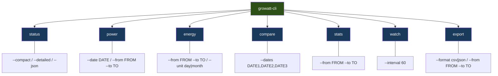
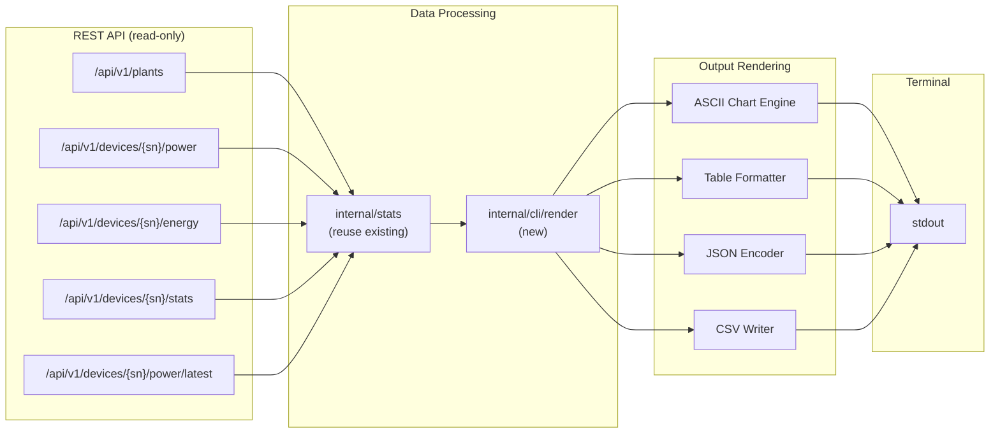
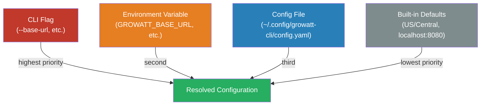
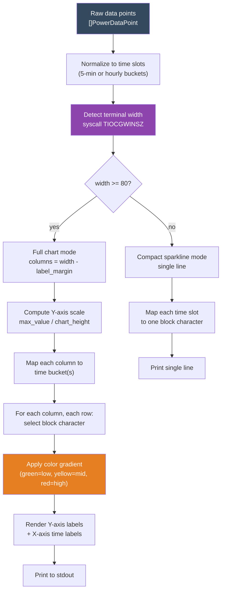

# CLI Tool Design: `growatt-cli`

## Overview

A unified CLI tool that queries the GoGrowatt REST API (the same read-only API the web frontend uses) and renders solar production data as ASCII charts, tables, and machine-readable exports directly in the terminal.

This replaces the current split between `growatt-export` (CSV/markdown file export with optional ASCII graph) and `growatt-power` (single-value current power query). The new tool consolidates both into a single cobra-based binary with proper subcommands.

---

## 1. Command Tree Structure



### Global Flags (inherited by all subcommands)

| Flag | Env Var | Description |
|------|---------|-------------|
| `--base-url` | `GROWATT_BASE_URL` | REST API base URL (default: from config or `http://localhost:8080`) |
| `--device-sn` | `GROWATT_DEVICE_SN` | Device serial number |
| `--plant-id` | `GROWATT_PLANT_ID` | Plant ID |
| `--timezone` | `GROWATT_TIMEZONE` | Timezone for queries (default: `US/Central`) |
| `--no-color` | `NO_COLOR` | Disable color output (also honors the [NO_COLOR](https://no-color.org/) standard) |
| `--json` | - | Machine-readable JSON output |
| `--csv` | - | Machine-readable CSV output |
| `--config` | - | Path to config file |

The REST API is unauthenticated, so no `--token` or API key flag is needed.

---

## 2. Data Flow



The CLI talks exclusively to the REST API (`/api/v1/...`). It never contacts the upstream Growatt cloud API directly. The REST API serves as the single data source, backed by the local database.

### Existing Code Reuse

The existing codebase provides a solid foundation. The new CLI reuses:

| Component | Location | What it provides |
|-----------|----------|------------------|
| `pkg/growatt` types | `/gogrowatt/pkg/growatt/types.go` | `Plant`, `PowerData`, `EnergyData`, `FlexFloat`, `FlexString` |
| `internal/stats` | `/gogrowatt/internal/stats/stats.go` | `AggregateToHourly`, `AggregateDays`, `CalculateMedian`, `CalculateStdDev` |
| Resolution patterns | `/gogrowatt/cmd/growatt-export/main.go` | Plant/device auto-detection logic (lines 219-322) |
| ASCII graph | `/gogrowatt/cmd/growatt-export/main.go` | `printASCIIGraph` function (lines 468-563) as starting point |

Note: `pkg/growatt.Client` is NOT used by the CLI. That client targets the upstream Growatt cloud API, which only the fetcher uses. The CLI uses a simple HTTP client to call the local REST API.

### What the New Tool Adds

| Component | Purpose |
|-----------|---------|
| `internal/cli/apiclient.go` | Lightweight HTTP client for the local REST API (`/api/v1/...`) |
| `internal/cli/render/chart.go` | Unicode block chart engine with terminal width detection |
| `internal/cli/render/table.go` | Tabular output with alignment and color |
| `internal/cli/render/color.go` | ANSI color support with `--no-color` / `NO_COLOR` awareness |
| `internal/cli/render/sparkline.go` | Compact sparkline rendering |
| `internal/cli/config.go` | Config file resolution |
| `cmd/growatt-cli/main.go` | Cobra command tree |
| `cmd/growatt-cli/cmd_*.go` | One file per subcommand |

---

## 3. Configuration Resolution Order



### Config File Format

Located at `~/.config/growatt-cli/config.yaml` (or `$XDG_CONFIG_HOME/growatt-cli/config.yaml`):

```yaml
base_url: "http://localhost:8080"
plant_id: "12345"
device_sn: "ABC1234567"
timezone: "US/Central"
```

The config file path can be overridden with `--config /path/to/config.yaml`.

### Resolution Implementation

```go
// internal/cli/config.go

type Config struct {
    BaseURL  string `yaml:"base_url"`
    PlantID  string `yaml:"plant_id"`
    DeviceSN string `yaml:"device_sn"`
    Timezone string `yaml:"timezone"`
}

// Resolve merges flag > env > file > defaults
func Resolve(flags *pflag.FlagSet) (*Config, error) {
    cfg := &Config{
        Timezone: "US/Central",
    }

    // Load config file (lowest priority base)
    if path := configFilePath(flags); path != "" {
        loadYAML(path, cfg)
    }

    // Overlay environment variables
    envOverlay(cfg)

    // Overlay CLI flags (highest priority)
    flagOverlay(flags, cfg)

    return cfg, nil
}
```

---

## 4. Command Specifications

### 4.1 `growatt-cli status`

Fetches current power and today's energy from `/api/v1/plants` (reuses the same `ListPlants` call that `growatt-power` uses today).

**Flags:**
- `--compact` (default): one-line output
- `--detailed`: multi-line with all fields
- `--json` / `--csv`: machine-readable

**Example Output -- Compact (default):**

```
$ growatt-cli status
1,847 W now | 12.4 kWh today | peak 2,614 W
```

**Example Output -- Detailed:**

```
$ growatt-cli status --detailed
Plant:         My Solar Home
Status:        Online
Current Power: 1,847 W
Today Energy:  12.4 kWh
Total Energy:  1,234.5 kWh
Peak Power:    2,614 W
```

**Example Output -- JSON:**

```json
$ growatt-cli status --json
{
  "plant_id": "12345",
  "plant_name": "My Solar Home",
  "pac_w": 1847,
  "today_energy_kwh": 12.4,
  "total_energy_kwh": 1234.5,
  "peak_pac_w": 2614,
  "status": 1,
  "timestamp": "2026-02-15T12:53:00-06:00"
}
```

### 4.2 `growatt-cli power`

Fetches 5-minute interval power data and renders an ASCII time-series chart. Uses `GET /api/v1/devices/{sn}/power?date=DATE`.

**Flags:**
- `--date DATE` (default: today)
- `--from FROM --to TO` (multi-day, averages across days)
- `--sparkline`: compact single-line sparkline

**Example Output -- Single Day Chart:**

```
$ growatt-cli power --date 2026-02-15
Power Production - 2026-02-15 (Total: 7.31 kWh)

  5.4 kW |                                                ▓
         |                                          ▓▓▓▓▓▓▓▓
         |                                        ▓▓▓▓▓▓▓▓▓▓▓▓
         |                                    ▓▓▓▓▓▓▓▓▓▓▓▓▓▓▓▓
  2.7 kW |                                ▓▓▓▓▓▓▓▓▓▓▓▓▓▓▓▓▓▓▓▓
         |                              ▓▓▓▓▓▓▓▓▓▓▓▓▓▓▓▓▓▓▓▓▓▓
         |                          ░░▓▓▓▓▓▓▓▓▓▓▓▓▓▓▓▓▓▓▓▓▓▓▓▓
         |                      ░░░░░░▓▓▓▓▓▓▓▓▓▓▓▓▓▓▓▓▓▓▓▓▓▓▓▓
         |                  ░░░░░░░░░░▓▓▓▓▓▓▓▓▓▓▓▓▓▓▓▓▓▓▓▓▓▓▓▓
         |              ░░░░░░░░░░░░░░▓▓▓▓▓▓▓▓▓▓▓▓▓▓▓▓▓▓▓▓▓▓▓▓
  0.0 kW |__________░░░░░░░░░░░░░░░░░░▓▓▓▓▓▓▓▓▓▓▓▓▓▓▓▓▓▓▓▓▓▓▓▓____
         06    07    08    09    10    11    12    13    14    15    16
                              Hour of day
```

**Example Output -- Sparkline:**

```
$ growatt-cli power --date 2026-02-15 --sparkline
2026-02-15: ▁▁▁▁▁▁▁▂▃▄▅▆▇█▇▆▅▃▂▁▁▁▁▁  7.31 kWh
```

### 4.3 `growatt-cli energy`

Fetches daily or monthly energy totals and renders a horizontal bar chart. Uses `GET /api/v1/devices/{sn}/energy?start_date=X&end_date=Y&time_unit=Z`.

**Flags:**
- `--from FROM --to TO` (required)
- `--unit day|month` (default: `day`)
- `--sparkline`: compact output

**Example Output -- Daily Bar Chart:**

```
$ growatt-cli energy --from 2026-02-01 --to 2026-02-15 --unit day
Energy Production (kWh) - 2026-02-01 to 2026-02-15

Feb 01 |  8.2 ████████████████▎
Feb 02 | 12.1 ████████████████████████▏
Feb 03 |  3.4 ██████▊
Feb 04 | 15.3 ██████████████████████████████▌
Feb 05 | 14.7 █████████████████████████████▍
Feb 06 |  0.0
Feb 07 |  6.8 █████████████▌
Feb 08 | 11.9 ███████████████████████▊
Feb 09 | 13.5 ███████████████████████████
Feb 10 | 10.2 ████████████████████▍
Feb 11 | 14.1 ████████████████████████████▏
Feb 12 |  9.8 ███████████████████▌
Feb 13 | 12.7 █████████████████████████▍
Feb 14 | 11.3 ██████████████████████▌
Feb 15 |  7.3 ██████████████▌
       ──────┼──────────────────────────────────
             0        5       10       15   kWh

Total: 151.3 kWh | Avg: 10.1 kWh/day | Best: Feb 04 (15.3 kWh)
```

**Example Output -- Monthly:**

```
$ growatt-cli energy --from 2025-09-01 --to 2026-02-15 --unit month
Energy Production (kWh) - Sep 2025 to Feb 2026

Sep 2025 | 312.4 ████████████████████████████████████████
Oct 2025 | 245.1 ███████████████████████████████▍
Nov 2025 | 178.2 ██████████████████████▊
Dec 2025 | 132.5 █████████████████
Jan 2026 | 156.8 ████████████████████
Feb 2026 |  98.3 ████████████▌
         ────────┼────────────────────────────────────────
                 0       100      200      300    kWh
```

### 4.4 `growatt-cli compare`

Overlay multiple days on the same time axis to spot anomalies like the 13:00 doubling visible in the data (see `data/0215/power_2026-02-15.csv` line 67: `12:53,5389.90` -- a spike to 5.4 kW when surrounding values are ~2.8 kW).

**Flags:**
- `--dates DATE1,DATE2,...` (comma-separated, 2-5 dates)
- `--sparkline`: compact multi-line sparklines

**Example Output:**

```
$ growatt-cli compare --dates 2026-02-12,2026-02-13,2026-02-14,2026-02-15
Power Comparison (W)

       06    07    08    09    10    11    12    13    14    15    16    17
       :     :     :     :     :     :     :     :     :     :     :     :
 Feb12 .     .   ░░░▒▒▒▒▓▓▓▓▓▓████████████▓▓▓▓▓▓▒▒▒▒░░░.     .     .
 Feb13 .     .  ░░░░▒▒▒▒▒▓▓▓▓████████████████▓▓▓▓▒▒▒░░░░.     .     .
 Feb14 .     . ░░░▒▒▒▒▓▓▓▓▓▓▓█████████████████▓▓▓▓▒▒▒░░.      .     .
 Feb15 .     . ░░▒▒▒▓▓▓▓██████████████*       .     .     .     .     .
       :     :     :     :     :     :  ^  :     :     :     :     :     :
                                        |
                                   5389W spike at 12:53
                                   (data ends here for today)

Legend: . <100W  ░ <500W  ▒ <1kW  ▓ <2kW  █ <3kW  * anomaly (>2x neighbors)

        |  Feb 12   Feb 13   Feb 14   Feb 15
  Peak  |  2,841W   3,012W   2,956W   5,390W*
  Total |  14.2kWh  15.1kWh  14.7kWh  7.3kWh
```

**Anomaly Detection Logic:**

The compare command flags data points where power exceeds 2x the average of their immediate neighbors. This catches the "13:00 doubling" pattern visible at `12:53` on `2026-02-15` (5389.9W when neighbors are ~2700-2800W).

### 4.5 `growatt-cli stats`

Tabular statistics aggregated by hour. Uses `GET /api/v1/devices/{sn}/stats?from=X&to=Y` (which provides pre-aggregated multi-day stats) or computes locally from `GET /api/v1/devices/{sn}/power` data using the existing `internal/stats` package.

**Flags:**
- `--from FROM --to TO` (required)

**Example Output:**

```
$ growatt-cli stats --from 2026-02-12 --to 2026-02-15
Power Statistics - 2026-02-12 to 2026-02-15 (4 days)

 Hour  |  Min (W)  Max (W)  Avg (W)  Median (W)  StdDev  | Days
───────┼──────────────────────────────────────────────────┼──────
 07:00 |      0.0    156.3     62.4       58.1     41.2   |    4
 08:00 |    112.5    425.0    267.8      261.4     85.3   |    4
 09:00 |    338.8  1,102.0    621.5      584.7    198.6   |    4
 10:00 |  1,112.4  2,168.5  1,523.8    1,496.4    287.1   |    4
 11:00 |  1,689.5  2,614.9  2,045.2    2,007.3    256.8   |    4
 12:00 |  2,339.4  5,389.9  2,987.3    2,828.1    512.4   |    4
 13:00 |  2,156.0  3,245.0  2,801.5    2,834.2    301.2   |    3
 14:00 |  1,845.0  2,912.0  2,456.8    2,501.3    278.9   |    3
 15:00 |  1,023.0  2,145.0  1,678.4    1,712.5    312.1   |    3
 16:00 |    245.0    856.0    534.2      512.8    178.5   |    3
 17:00 |      0.0    245.0     98.4       82.1     72.3   |    3
───────┼──────────────────────────────────────────────────┼──────
Summary: Peak hour 12:00 (avg 2,987 W) | Daily avg: 11.5 kWh | Total: 46.1 kWh

Note: Hour 12 max of 5,390W is flagged as anomalous (>2x median).
```

### 4.6 `growatt-cli watch`

Live-updating terminal dashboard that refreshes on a configurable interval. Combines status + today's power sparkline into a compact display. Uses `GET /api/v1/devices/{sn}/power/latest` for the current reading and `GET /api/v1/devices/{sn}/power` for today's history.

**Flags:**
- `--interval N` (seconds, default: 60, minimum: 30)

**Example Output (refreshes in-place using ANSI cursor control):**

```
$ growatt-cli watch
growatt-cli watch | My Solar Home | refreshing every 60s | Ctrl+C to stop
────────────────────────────────────────────────────────────────────────
Current:  1,847 W    Today: 7.31 kWh    Peak: 2,614 W    Status: Online

Today: ▁▁▁▁▁▁▁▂▃▄▅▆▇█▇  (07:00-12:53)
       07  08  09  10  11  12  13  14  15  16  17

 2.6 kW |              ██
         |          ████████
         |        ██████████
         |      ████████████
  1.3 kW |    ██████████████
         |  ░░██████████████
         | ░░░██████████████
  0.0 kW |░░░░██████████████
         07  08  09  10  11  12  now
                                  ^
                              1,847 W

Last updated: 12:53:00 CST
```

**Implementation Notes:**
- Uses ANSI escape codes (`\033[H` to home cursor, `\033[2J` to clear) for in-place refresh
- Graceful shutdown on SIGINT/SIGTERM (same pattern as existing `growatt-power` continuous mode at `/gogrowatt/cmd/growatt-power/main.go` lines 107-131)
- Falls back to simple print-and-newline if terminal does not support ANSI (piped to file, etc.)

### 4.7 `growatt-cli export`

Dumps raw data to stdout in CSV or JSON format. Replaces the file-writing behavior of `growatt-export` with a stdout-oriented pipeline-friendly approach.

**Flags:**
- `--format csv|json` (default: `csv`)
- `--from FROM --to TO` (required)
- `--resolution raw|hourly` (default: `raw`; `raw` = 5-min intervals, `hourly` = aggregated)

**Example Output -- CSV:**

```
$ growatt-cli export --from 2026-02-15 --to 2026-02-15 --format csv
ts,pac_w
2026-02-15T07:28:00-06:00,0.00
2026-02-15T07:33:00-06:00,5.00
2026-02-15T07:38:00-06:00,29.90
...
```

**Example Output -- JSON:**

```
$ growatt-cli export --from 2026-02-15 --to 2026-02-15 --format json
[
  {"ts": "2026-02-15T07:28:00-06:00", "pac_w": 0.00},
  {"ts": "2026-02-15T07:33:00-06:00", "pac_w": 5.00},
  ...
]
```

**Example Output -- Hourly CSV:**

```
$ growatt-cli export --from 2026-02-15 --to 2026-02-15 --format csv --resolution hourly
ts,min_pac_w,max_pac_w,avg_pac_w,samples
2026-02-15T07:00:00-06:00,0,120.90,56.17,7
2026-02-15T08:00:00-06:00,136.60,383.10,253.34,12
...
```

---

## 5. Chart Rendering Algorithm

### 5.1 Unicode Block Character Mapping

The existing `printASCIIGraph` in `growatt-export` uses `#` characters at fixed `barWidth=2`. The new renderer uses Unicode block elements for 8x vertical resolution per character cell:

```
Character | Fill fraction | Threshold
──────────┼───────────────┼──────────
  (space) |  0/8          | value < step*0
    ▁     |  1/8          | value >= step*1
    ▂     |  2/8          | value >= step*2
    ▃     |  3/8          | value >= step*3
    ▄     |  4/8          | value >= step*4
    ▅     |  5/8          | value >= step*5
    ▆     |  6/8          | value >= step*6
    ▇     |  7/8          | value >= step*7
    █     |  8/8          | value >= step*8
```

### 5.2 Chart Rendering Pipeline



### 5.3 Responsive Width Calculation

```go
// internal/cli/render/terminal.go

func TerminalWidth() int {
    // Try ioctl TIOCGWINSZ
    ws, err := unix.IoctlGetWinsize(int(os.Stdout.Fd()), unix.TIOCGWINSZ)
    if err == nil && ws.Col > 0 {
        return int(ws.Col)
    }

    // Fallback: COLUMNS env var
    if cols := os.Getenv("COLUMNS"); cols != "" {
        if n, err := strconv.Atoi(cols); err == nil && n > 0 {
            return n
        }
    }

    // Default
    return 80
}

const (
    yAxisWidth    = 8  // "5,389 |"
    rightMargin   = 2
)

func ChartColumns(termWidth int) int {
    return termWidth - yAxisWidth - rightMargin
}
```

### 5.4 Column-to-Time Mapping

When terminal width is less than the number of data points, multiple data points are averaged into a single column:

```go
// Given 288 data points (24h * 12 per hour) and 70 chart columns:
// pointsPerColumn = ceil(288 / 70) = 5
// Each column represents ~25 minutes of data

func mapDataToColumns(points []float64, numColumns int) []float64 {
    columns := make([]float64, numColumns)
    pointsPerCol := float64(len(points)) / float64(numColumns)

    for col := 0; col < numColumns; col++ {
        start := int(float64(col) * pointsPerCol)
        end := int(float64(col+1) * pointsPerCol)
        if end > len(points) {
            end = len(points)
        }

        var sum float64
        count := 0
        for i := start; i < end; i++ {
            sum += points[i]
            count++
        }
        if count > 0 {
            columns[col] = sum / float64(count)
        }
    }
    return columns
}
```

### 5.5 Color Scheme

Colors are applied per-cell based on the power value relative to the day's range:

| Range | Color | ANSI Code | Meaning |
|-------|-------|-----------|---------|
| 0-25% of max | Green | `\033[32m` | Low production (morning/evening) |
| 25-50% | Yellow | `\033[33m` | Moderate production |
| 50-75% | Bright Yellow | `\033[93m` | Good production |
| 75-100% | Bright White | `\033[97m` | Peak production |
| Anomaly (>2x neighbors) | Red | `\033[31m` | Data anomaly flagged |

When `--no-color` is set or `NO_COLOR` environment variable is present, all ANSI codes are suppressed.

### 5.6 Rendering a Single Column (Vertical Bar)

```go
// blocks maps a fractional fill (0.0-1.0) to a Unicode block character
var blocks = []rune{' ', '▁', '▂', '▃', '▄', '▅', '▆', '▇', '█'}

func renderColumn(value, maxValue float64, chartHeight int) []rune {
    col := make([]rune, chartHeight)

    // How many "eighths" of a row does this value fill?
    totalEighths := int((value / maxValue) * float64(chartHeight) * 8)

    for row := 0; row < chartHeight; row++ {
        rowFromBottom := row
        eighthsBelow := rowFromBottom * 8

        if totalEighths >= eighthsBelow+8 {
            col[row] = '█' // fully filled
        } else if totalEighths > eighthsBelow {
            col[row] = blocks[totalEighths-eighthsBelow]
        } else {
            col[row] = ' ' // empty
        }
    }

    return col // index 0 = bottom row
}
```

---

## 6. Project Structure

```
cmd/
  growatt-cli/
    main.go           # Cobra root command, global flags
    cmd_status.go     # status subcommand
    cmd_power.go      # power subcommand
    cmd_energy.go     # energy subcommand
    cmd_compare.go    # compare subcommand
    cmd_stats.go      # stats subcommand
    cmd_watch.go      # watch subcommand
    cmd_export.go     # export subcommand
internal/
  cli/
    apiclient.go      # Lightweight HTTP client for the local REST API
    config.go         # Config file loading + resolution
    resolve.go        # Plant/device auto-detection (extracted from growatt-export)
    render/
      chart.go        # Vertical bar chart (Unicode blocks)
      sparkline.go    # Single-line sparkline
      table.go        # Aligned tabular output
      color.go        # ANSI color with NO_COLOR support
      terminal.go     # Terminal width detection
  stats/
    stats.go          # (existing) HourlyStats, DailyStats, aggregation
pkg/
  growatt/
    client.go         # (existing) HTTP client -- used by fetcher only, NOT by the CLI
    plant.go          # (existing) Plant API methods
    device.go         # (existing) Device API methods
    types.go          # (existing) Data types -- shared type definitions reused by CLI
```

---

## 7. API Endpoint Mapping

Each CLI command maps to specific REST API endpoints. The CLI exclusively uses the local REST API (`/api/v1/...`) and never falls back to the upstream Growatt cloud API.

| Command | REST API Endpoint |
|---------|------------------|
| `status` | `GET /api/v1/plants` |
| `power` | `GET /api/v1/devices/{sn}/power?date=DATE` |
| `energy` | `GET /api/v1/devices/{sn}/energy?start_date=X&end_date=Y&time_unit=Z` |
| `compare` | `GET /api/v1/devices/{sn}/power?date=DATE` (one call per date) |
| `stats` | `GET /api/v1/devices/{sn}/stats?from=X&to=Y` (or local computation from power data) |
| `watch` | `GET /api/v1/devices/{sn}/power/latest` + `GET /api/v1/devices/{sn}/power` |
| `export` | `GET /api/v1/devices/{sn}/power?date=DATE` (per day in range) |

---

## 8. Error Handling and Edge Cases

### Rate Limiting

The REST API is local and fast, so aggressive rate limiting is unnecessary. For commands that make multiple API calls (e.g., `compare --dates` with 5 dates), the CLI shows a progress indicator:

```
Fetching 5 days... [███░░] 3/5
```

### No Data

When a date has no production data (nighttime, cloudy day, system offline):

```
$ growatt-cli power --date 2026-01-15
No power data for 2026-01-15.
```

### Partial Data (today, mid-day)

The chart renders only the available portion, as shown in the `watch` example. The x-axis shows a "now" marker.

### Anomaly in Data

The 12:53 spike to 5389.9W on 2026-02-15 (visible in `/gogrowatt/data/0215/power_2026-02-15.csv` line 67) is ~2x the surrounding values (~2800W). The `compare` and `stats` commands flag these with color (red) and a note. The `export` command outputs raw data without filtering -- anomaly detection is display-only.

---

## 9. Dependencies

| Dependency | Purpose | Status |
|------------|---------|--------|
| `github.com/spf13/cobra` | CLI framework | Already in `go.mod` |
| `github.com/spf13/pflag` | Flag parsing (transitive via cobra) | Already in `go.mod` |
| `golang.org/x/term` | Terminal size detection | New (stdlib-adjacent) |
| `gopkg.in/yaml.v3` | Config file parsing | New |

The tool avoids heavy dependencies like `lipgloss`, `bubbletea`, or `termbox`. All rendering is done with direct ANSI escape codes and `fmt.Printf`, keeping the binary small and the code straightforward -- consistent with the existing tools in the repo.

---

## 10. Build and Install

Added to the existing `Makefile`:

```makefile
build-cli:
	go build -o bin/growatt-cli ./cmd/growatt-cli

install-cli:
	go install ./cmd/growatt-cli
```

The binary name `growatt-cli` is chosen to avoid conflict with the existing `growatt-export` and `growatt-power` binaries, while signaling that this is the unified replacement.

---

## 11. Testing

### 11.1 Unit Tests: Chart Rendering

Test the Unicode block character selection logic in `internal/cli/render/chart.go`. Feed known data arrays into `renderColumn` and verify:

- A value of 0 produces all space characters.
- A value equal to `maxValue` produces all `█` characters.
- A value at exactly 50% of max produces the correct mix of full blocks and a `▄` (4/8) at the top.
- Fractional values map to the correct block character (e.g., 3/8 of a row yields `▃`).

```go
func TestRenderColumn(t *testing.T) {
    tests := []struct {
        name        string
        value       float64
        maxValue    float64
        chartHeight int
        wantBottom  rune // bottom row character
        wantTop     rune // topmost non-space character
    }{
        {"zero", 0, 100, 10, ' ', ' '},
        {"full", 100, 100, 10, '█', '█'},
        {"half", 50, 100, 8, '█', '▄'},
        {"quarter", 25, 100, 8, '█', '▄'}, // 2 full rows of 8
    }
    for _, tt := range tests {
        t.Run(tt.name, func(t *testing.T) {
            col := renderColumn(tt.value, tt.maxValue, tt.chartHeight)
            // verify bottom and top characters
        })
    }
}
```

### 11.2 Unit Tests: Sparkline Generation

Test `internal/cli/render/sparkline.go` with known inputs:

- All zeros produces all `▁` characters (floor, not blank).
- Monotonically increasing values produce `▁▂▃▄▅▆▇█`.
- A single spike in flat data produces a single `█` surrounded by `▁`.
- Empty input returns an empty string.

```go
func TestSparkline(t *testing.T) {
    got := Sparkline([]float64{0, 1, 2, 3, 4, 5, 6, 7})
    want := "▁▂▃▄▅▆▇█"
    if got != want {
        t.Errorf("Sparkline() = %q, want %q", got, want)
    }
}
```

### 11.3 Unit Tests: Terminal Width Handling

Mock different terminal widths (40, 80, 120, 200) and verify `ChartColumns` returns the correct usable width after subtracting the y-axis label and right margin:

```go
func TestChartColumns(t *testing.T) {
    tests := []struct {
        termWidth int
        want      int
    }{
        {40, 30},   // 40 - 8 (yAxis) - 2 (margin)
        {80, 70},
        {120, 110},
        {200, 190},
    }
    for _, tt := range tests {
        got := ChartColumns(tt.termWidth)
        if got != tt.want {
            t.Errorf("ChartColumns(%d) = %d, want %d", tt.termWidth, got, tt.want)
        }
    }
}
```

Also verify that narrow terminals (width < 80) trigger sparkline fallback mode in the chart rendering pipeline.

### 11.4 Unit Tests: Color Output

Test `internal/cli/render/color.go`:

- When color is enabled, verify output strings contain ANSI escape codes (e.g., `\033[32m` for green).
- When `--no-color` is set or `NO_COLOR` env var is present, verify output strings contain zero ANSI escape codes.
- Use a regex like `\x1b\[\d+m` to detect ANSI sequences in rendered output.

```go
func TestColorEnabled(t *testing.T) {
    c := NewColorizer(true) // color on
    out := c.Green("hello")
    if !strings.Contains(out, "\033[32m") {
        t.Error("expected ANSI green code")
    }
}

func TestColorDisabled(t *testing.T) {
    c := NewColorizer(false) // color off
    out := c.Green("hello")
    if strings.Contains(out, "\033[") {
        t.Error("unexpected ANSI code with color disabled")
    }
    if out != "hello" {
        t.Errorf("got %q, want %q", out, "hello")
    }
}
```

### 11.5 Integration Tests: REST API Round-Trip

Start the REST API server with a known test dataset (loaded into the database from fixture files), then run each CLI command and verify the output contains expected values:

```go
func TestIntegration(t *testing.T) {
    if testing.Short() {
        t.Skip("skipping integration test")
    }
    // Start REST API with test data (use testcontainers or the test harness from doc 07)
    baseURL := startTestServer(t)

    commands := []struct {
        args     []string
        contains []string
    }{
        {[]string{"status", "--base-url", baseURL}, []string{"W now", "kWh today"}},
        {[]string{"power", "--base-url", baseURL, "--date", "2026-02-15"}, []string{"Power Production", "2026-02-15"}},
        {[]string{"energy", "--base-url", baseURL, "--from", "2026-02-12", "--to", "2026-02-15"}, []string{"Energy Production", "kWh"}},
        {[]string{"export", "--base-url", baseURL, "--from", "2026-02-15", "--to", "2026-02-15", "--format", "json"}, []string{"pac_w", "ts"}},
    }
    for _, cmd := range commands {
        out := runCLI(t, cmd.args...)
        for _, s := range cmd.contains {
            if !strings.Contains(out, s) {
                t.Errorf("command %v: output missing %q", cmd.args, s)
            }
        }
    }
}
```

### 11.6 Snapshot Tests: Golden File Comparison

For each command, capture the full stdout output when run against a fixed test dataset and compare against golden files stored in `testdata/`:

- `testdata/golden/status_compact.txt`
- `testdata/golden/status_detailed.txt`
- `testdata/golden/power_2026-02-15.txt`
- `testdata/golden/energy_daily.txt`
- `testdata/golden/compare_feb12-15.txt`
- `testdata/golden/stats_feb12-15.txt`
- `testdata/golden/export_csv.txt`
- `testdata/golden/export_json.txt`

Use `--no-color` for all golden file tests to avoid ANSI codes in the comparison. Update golden files with `go test -update` flag pattern.

```go
func TestGolden(t *testing.T) {
    out := runCLI(t, "power", "--base-url", testBaseURL, "--date", "2026-02-15", "--no-color")
    goldenFile := filepath.Join("testdata", "golden", "power_2026-02-15.txt")

    if *update {
        os.WriteFile(goldenFile, []byte(out), 0644)
        return
    }
    expected, _ := os.ReadFile(goldenFile)
    if out != string(expected) {
        t.Errorf("output differs from golden file %s", goldenFile)
    }
}
```

### 11.7 Test `compare` Anomaly Detection

Feed the real Feb 12-15 power data pattern into the anomaly detector. The 12:55 reading on Feb 15 shows a doubling (~5390W when neighbors are ~2700-2800W). Verify:

- The spike at 12:53/12:55 is flagged as anomalous (value > 2x average of immediate neighbors).
- Normal peaks (e.g., 3012W on Feb 13 when neighbors are ~2900W) are NOT flagged.
- The anomaly summary table marks the Feb 15 peak with an asterisk.

```go
func TestAnomalyDetection(t *testing.T) {
    // Simulated 12:43 through 13:03 readings for Feb 15
    readings := []float64{2734, 2801, 2789, 5389.9, 2812, 2756}
    anomalies := detectAnomalies(readings, 2.0) // threshold = 2x neighbors

    if len(anomalies) != 1 {
        t.Fatalf("expected 1 anomaly, got %d", len(anomalies))
    }
    if anomalies[0].Index != 3 {
        t.Errorf("anomaly at index %d, want 3", anomalies[0].Index)
    }
}
```

### 11.8 Test `watch` Mode

- Verify that output contains ANSI cursor control codes (`\033[H` for cursor home, `\033[2J` for clear screen) when stdout is a TTY.
- Verify that when stdout is piped (not a TTY), the output falls back to plain newline-separated refreshes without ANSI cursor control.
- Verify graceful shutdown: send SIGINT to the process and confirm it exits with code 0, prints no error, and does not leave the terminal in a broken state (i.e., cursor is visible, normal mode is restored).

### 11.9 Test `export` Formats

- **CSV**: Parse the output with `encoding/csv` and verify the header row contains `ts,pac_w`, each row has the correct number of fields, and numeric fields parse as valid floats.
- **JSON**: Parse the output with `encoding/json` into `[]map[string]interface{}` and verify each record has `ts` (string) and `pac_w` (number) fields.
- **Hourly CSV**: Verify the header contains `ts,min_pac_w,max_pac_w,avg_pac_w,samples` and that `samples` values are positive integers.

```go
func TestExportCSV(t *testing.T) {
    out := runCLI(t, "export", "--base-url", testBaseURL, "--from", "2026-02-15", "--to", "2026-02-15", "--format", "csv")
    r := csv.NewReader(strings.NewReader(out))
    records, err := r.ReadAll()
    require.NoError(t, err)
    require.Equal(t, "ts", records[0][0])
    require.Equal(t, "pac_w", records[0][1])
    for _, row := range records[1:] {
        _, err := strconv.ParseFloat(row[1], 64)
        require.NoError(t, err, "pac_w should be a valid float")
    }
}

func TestExportJSON(t *testing.T) {
    out := runCLI(t, "export", "--base-url", testBaseURL, "--from", "2026-02-15", "--to", "2026-02-15", "--format", "json")
    var records []map[string]interface{}
    require.NoError(t, json.Unmarshal([]byte(out), &records))
    require.Greater(t, len(records), 0)
    require.Contains(t, records[0], "ts")
    require.Contains(t, records[0], "pac_w")
}
```

### 11.10 Test Config Resolution Priority

Set `--base-url` via flag, `GROWATT_BASE_URL` env var, and config file to three different values. Verify the resolution order is flag > env > config file > built-in default:

```go
func TestConfigResolution(t *testing.T) {
    // Write a config file with base_url = "http://from-file:8080"
    configPath := writeTestConfig(t, `base_url: "http://from-file:8080"`)

    // Set env var to a different value
    t.Setenv("GROWATT_BASE_URL", "http://from-env:8080")

    // Resolve with flag set to yet another value
    flags := pflag.NewFlagSet("test", pflag.ContinueOnError)
    flags.String("base-url", "", "")
    flags.String("config", configPath, "")
    flags.Set("base-url", "http://from-flag:8080")

    cfg, err := Resolve(flags)
    require.NoError(t, err)
    require.Equal(t, "http://from-flag:8080", cfg.BaseURL) // flag wins

    // Now without the flag
    flags2 := pflag.NewFlagSet("test2", pflag.ContinueOnError)
    flags2.String("base-url", "", "")
    flags2.String("config", configPath, "")

    cfg2, err := Resolve(flags2)
    require.NoError(t, err)
    require.Equal(t, "http://from-env:8080", cfg2.BaseURL) // env wins

    // Now without env var either
    t.Setenv("GROWATT_BASE_URL", "")
    cfg3, err := Resolve(flags2)
    require.NoError(t, err)
    require.Equal(t, "http://from-file:8080", cfg3.BaseURL) // file wins
}
```

### 11.11 Test with No Data

Verify each command handles empty API responses gracefully (no panic, no stack trace):

- `status` with no plants: prints a clear "No plants found" message, exits 0.
- `power` with no readings for the date: prints "No power data for DATE.", exits 0.
- `energy` with no data in range: prints "No energy data for the requested period.", exits 0.
- `compare` with no data for any date: prints "No data available for any of the requested dates.", exits 0.
- `stats` with no data: prints "No data available for statistics.", exits 0.
- `export` with no data: outputs only the CSV header row (no data rows) for CSV format, or `[]` for JSON format, exits 0.

```go
func TestEmptyResponses(t *testing.T) {
    // Start test server that returns empty arrays for all endpoints
    baseURL := startEmptyTestServer(t)

    commands := []struct {
        args    []string
        wantOut string
    }{
        {[]string{"status"}, "No plants found"},
        {[]string{"power", "--date", "2026-01-01"}, "No power data"},
        {[]string{"energy", "--from", "2026-01-01", "--to", "2026-01-31"}, "No energy data"},
        {[]string{"export", "--from", "2026-01-01", "--to", "2026-01-01", "--format", "json"}, "[]"},
    }
    for _, cmd := range commands {
        args := append(cmd.args, "--base-url", baseURL)
        out, exitCode := runCLIWithExit(t, args...)
        assert.Equal(t, 0, exitCode, "command %v should exit 0", cmd.args)
        assert.Contains(t, out, cmd.wantOut)
    }
}
```
