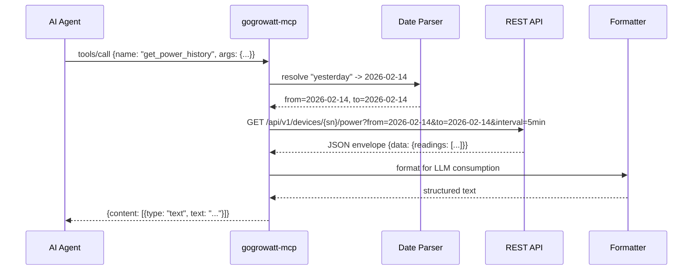
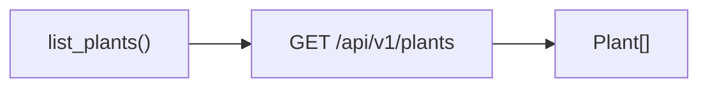
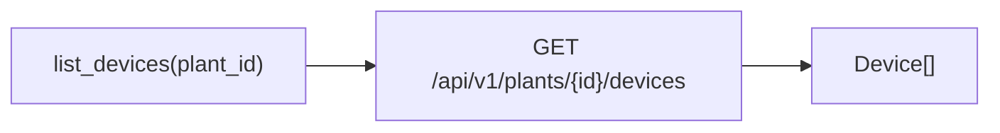
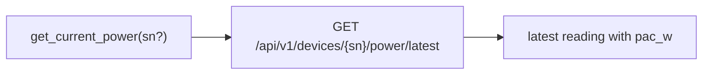
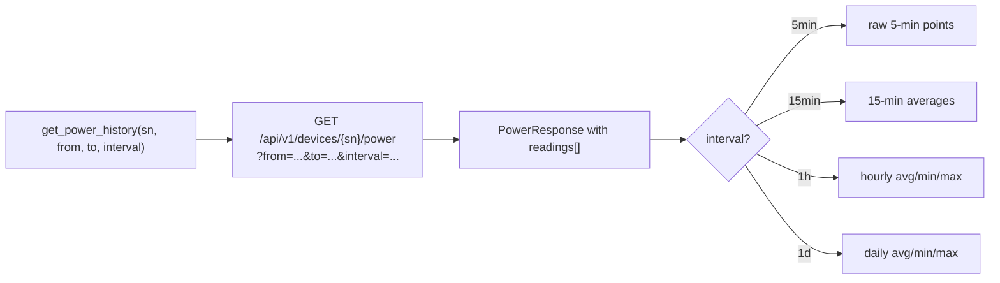
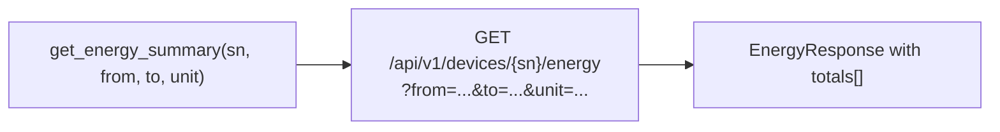
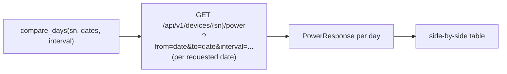
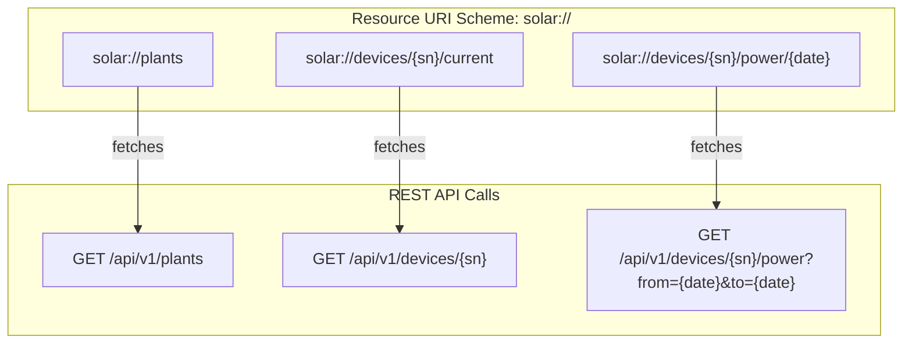

# MCP Server Design: gogrowatt-mcp

An MCP (Model Context Protocol) server that exposes Growatt solar production data
to AI agents over JSON-RPC via stdio. The server acts as a read-only bridge between
the gogrowatt REST API and any MCP-compatible client (Claude Desktop, Claude Code, etc.).

The MCP server does NOT talk to the Growatt cloud API directly. Only the data fetcher
service communicates with Growatt. The MCP server reads all data through the REST API
defined in doc 03 (`/api/v1/...`), which in turn reads from PostgreSQL.

## Architecture Overview

```mermaid
graph TB
    subgraph "AI Agent (MCP Client)"
        A[Claude / AI Agent]
    end

    subgraph "MCP Server Process (stdio)"
        B[gogrowatt-mcp]
        B1[JSON-RPC Handler]
        B2[Tool Registry]
        B3[Resource Registry]
        B4[Date Parser]
        B5[Response Formatter]
        B6[REST API Client<br/>internal/apiclient]

        B --> B1
        B1 --> B2
        B1 --> B3
        B2 --> B4
        B2 --> B6
        B3 --> B6
        B6 --> B5
    end

    subgraph "gogrowatt-api (REST API)"
        API[REST API<br/>localhost:8080/api/v1]
        API1[GET /plants]
        API2[GET /plants/{id}]
        API3[GET /plants/{id}/devices]
        API4[GET /devices/{sn}]
        API5[GET /devices/{sn}/power]
        API6[GET /devices/{sn}/energy]
        API7[GET /devices/{sn}/stats]
        API8[GET /devices/{sn}/power/latest]
        API --> API1 & API2 & API3 & API4 & API5 & API6 & API7 & API8
    end

    subgraph PostgreSQL
        DB[(power_readings<br/>energy_summaries<br/>plants / devices)]
    end

    A -- "stdin: JSON-RPC requests" --> B
    B -- "stdout: JSON-RPC responses" --> A
    B6 -- "HTTP GET" --> API
    API --> DB
```

## Tool Call Flow



## Data Model Reference

These types describe the JSON responses returned by the REST API (doc 03). The MCP
server deserializes these into Go structs for formatting. Field names use unit suffixes
to match the REST API and database schema.

```
Plant (from GET /api/v1/plants)
  id              string    -- unique identifier
  name            string    -- human-readable name
  country, city   string    -- location
  latitude        float64   -- GPS
  longitude       float64   -- GPS
  peak_power_kw   float64   -- system capacity (kW)
  current_power_w float64   -- live output (W)
  today_energy_kwh float64  -- today's production (kWh)
  total_energy_kwh float64  -- lifetime production (kWh)
  status          string    -- "online" or "offline"

Device (from GET /api/v1/devices/{sn})
  serial_number   string    -- serial number (primary key)
  plant_id        string    -- parent plant ID
  name            string    -- human name
  type            string    -- "inverter"
  model           string    -- hardware model
  status          string    -- "online" or "offline"
  last_update     string    -- ISO timestamp
  current         object    -- live readings (see below)

DeviceCurrent (nested in Device response)
  pac_w           float64   -- AC power output (W)
  ppv_w           float64   -- total PV power (W)
  vpv1_v          float64   -- PV string 1 voltage (V)
  vpv2_v          float64   -- PV string 2 voltage (V)
  ipv1_a          float64   -- PV string 1 current (A)
  ipv2_a          float64   -- PV string 2 current (A)
  vac1_v          float64   -- AC voltage (V)
  iac1_a          float64   -- AC current (A)
  frequency_hz    float64   -- AC frequency (Hz)
  temperature_c   float64   -- inverter temperature (C)
  today_energy_kwh float64  -- energy today (kWh)
  total_energy_kwh float64  -- lifetime energy (kWh)

PowerReading (from GET /api/v1/devices/{sn}/power, interval=5min)
  time            string    -- RFC 3339 timestamp
  pac_w           float64   -- AC power (W)

PowerReadingHourly (from GET /api/v1/devices/{sn}/power, interval=1h)
  time            string    -- RFC 3339 timestamp
  pac             object    -- {avg, min, max, samples}

EnergyTotal (from GET /api/v1/devices/{sn}/energy)
  date            string    -- "YYYY-MM-DD" or "YYYY-MM"
  energy_kwh      float64   -- kWh

HourlyStats (from GET /api/v1/devices/{sn}/stats)
  hour            int       -- 0-23
  min_w           float64   -- lowest reading (W)
  max_w           float64   -- highest reading (W)
  avg_w           float64   -- mean across days (W)
  median_w        float64   -- median of daily means (W)
  stddev_w        float64   -- standard deviation (W)
  sample_days     int       -- number of days with data
```

## Tool Definitions

### 1. `list_plants`

Returns all solar plants registered in the system.



**Schema:**

```json
{
  "name": "list_plants",
  "description": "List all solar plants (power stations). Returns plant IDs, names, locations, system capacity, and current status. Use this first to discover available plant_id values needed by other tools.",
  "inputSchema": {
    "type": "object",
    "properties": {},
    "required": []
  }
}
```

**Response format:**

```
Solar Plants (1 found):

1. Home Solar
   Plant ID:       12345
   Location:       Austin, US (30.27, -97.74)
   System size:    8.4 kW
   Current power:  5,121 W
   Today's energy: 18.7 kWh
   Total energy:   12,450.3 kWh
   Status:         Online
```

---

### 2. `list_devices`

Returns all devices (inverters) for a given plant.



**Schema:**

```json
{
  "name": "list_devices",
  "description": "List all devices (inverters, meters) for a specific plant. Returns device serial numbers, types, models, and online/offline status. Use the device serial number (sn) from this response as the 'sn' parameter in power/energy/stats tools.",
  "inputSchema": {
    "type": "object",
    "properties": {
      "plant_id": {
        "type": "string",
        "description": "Plant ID from list_plants. Example: '12345'"
      }
    },
    "required": ["plant_id"]
  }
}
```

**Response format:**

```
Devices for plant 12345 (1 found):

1. MIN 6000TL-XH
   Serial:      TLXABC12345
   Type:        inverter
   Model:       MIN 6000TL-XH
   Status:      Online
   Last update: 2026-02-15T12:55:00-06:00
```

---

### 3. `get_device_details`

Returns live inverter readings including voltages, currents, and temperature.


**Schema:**

```json
{
  "name": "get_device_details",
  "description": "Get live readings from a specific inverter device. Returns current AC power output, today's energy, PV string voltages and currents (useful for diagnosing string imbalance), AC voltage/current/frequency, and inverter temperature. The 'sn' is the device serial number from list_devices.",
  "inputSchema": {
    "type": "object",
    "properties": {
      "sn": {
        "type": "string",
        "description": "Device serial number. Example: 'TLXABC12345'"
      }
    },
    "required": ["sn"]
  }
}
```

**Response format:**

```
Device TLXABC12345 - Live Readings

Power Output:
  AC Power (pac_w):       5,121 W
  PV Power (ppv_w):       5,250 W
  Today Energy:           18.7 kWh
  Total Energy:           12,450.3 kWh

PV Strings:
  String 1 (vpv1_v / ipv1_a):  324.5 V @ 8.12 A  (2635 W)
  String 2 (vpv2_v / ipv2_a):  318.2 V @ 8.35 A  (2657 W)

AC Output:
  Voltage (vac1_v):  243.1 V
  Current (iac1_a):  21.05 A
  Frequency:         60.01 Hz

Inverter:
  Temperature: 42.3 C
  Status:      Online
```

---

### 4. `get_current_power`

Returns current instantaneous power and today's energy production.



**Schema:**

```json
{
  "name": "get_current_power",
  "description": "Get the current instantaneous power output (watts) and latest reading for a device. If sn is omitted and GROWATT_DEVICE_SN is configured, it is used as the default. Best for quick 'how much power right now?' queries.",
  "inputSchema": {
    "type": "object",
    "properties": {
      "sn": {
        "type": "string",
        "description": "Device serial number. Optional if GROWATT_DEVICE_SN is set."
      }
    },
    "required": []
  }
}
```

**Response format:**

```
Current Solar Production (TLXABC12345):

  Power now (pac_w):  5,390 W
  PV power (ppv_w):   5,450 W
  String 1:           335.2 V @ 8.25 A
  String 2:           330.1 V @ 8.40 A

  Time: 2026-02-15T12:55:00-06:00
```

---

### 5. `get_power_history`

Returns time-series power data (watts) for a date range with configurable aggregation.



**Schema:**

```json
{
  "name": "get_power_history",
  "description": "Get historical power production data (watts) as a time series. Data is natively collected at 5-minute intervals. Use 'interval' to aggregate: '5min' for raw data (best for single-day analysis), '15min' for smoothed curves, '1h' for daily profiles (returns min/max/avg per hour), '1d' for multi-week trends. Date parameters accept: 'today', 'yesterday', 'YYYY-MM-DD', or relative like 'last-week'. For ranges over 7 days, prefer '1d' interval to keep response size manageable.",
  "inputSchema": {
    "type": "object",
    "properties": {
      "sn": {
        "type": "string",
        "description": "Device serial number from list_devices."
      },
      "from": {
        "type": "string",
        "description": "Start date. Accepts 'today', 'yesterday', 'last-week', or 'YYYY-MM-DD'. Default: 'today'."
      },
      "to": {
        "type": "string",
        "description": "End date (inclusive). Same formats as 'from'. Default: same as 'from'."
      },
      "interval": {
        "type": "string",
        "enum": ["5min", "15min", "1h", "1d"],
        "description": "Aggregation interval. Default: '5min' for single day, '1h' for multi-day."
      }
    },
    "required": ["sn"]
  }
}
```

**Response format (5min, single day):**

```
Power History - TLXABC12345
Date: 2026-02-15 | Interval: 5min | Points: 66

Time                           pac_w
-----------------------------+--------
2026-02-15T07:28:00-06:00        0.0
2026-02-15T07:33:00-06:00        5.0
2026-02-15T07:38:00-06:00       29.9
2026-02-15T07:43:00-06:00       57.2
...
2026-02-15T12:55:00-06:00    5,389.9
...
2026-02-15T18:55:00-06:00       14.9

Summary: Peak 5,389.9 W at 12:55 | Day total ~18.7 kWh
```

**Response format (1h, multi-day):**

```
Power History - TLXABC12345
Range: 2026-02-14 to 2026-02-15 | Interval: 1h

Time                           Avg(W)  Min(W)  Max(W)  Samples
-----------------------------+--------+-------+-------+-------
2026-02-14T11:00:00-06:00     2043.6  1629.5  2614.9     12
2026-02-14T12:00:00-06:00     2625.5  2339.4  2789.1     12
...
2026-02-15T07:00:00-06:00       56.2     0.0   120.9      7
2026-02-15T08:00:00-06:00      253.3   136.6   383.1     12
...

Summary: 2 days | Avg daily production: ~13.7 kWh
```

---

### 6. `get_energy_summary`

Returns energy totals (kWh) aggregated by day or month.



**Schema:**

```json
{
  "name": "get_energy_summary",
  "description": "Get energy production totals (kWh) aggregated by day or month. Unlike get_power_history which returns instantaneous power (watts), this returns actual metered energy totals. Use 'day' for daily totals (up to ~90 days), 'month' for monthly totals (up to years of data). This is the most accurate source for 'how much energy was produced' questions.",
  "inputSchema": {
    "type": "object",
    "properties": {
      "sn": {
        "type": "string",
        "description": "Device serial number from list_devices."
      },
      "from": {
        "type": "string",
        "description": "Start date. 'YYYY-MM-DD' for daily, 'YYYY-MM' for monthly. Also accepts 'today', 'yesterday', 'last-week', 'last-month'."
      },
      "to": {
        "type": "string",
        "description": "End date (inclusive). Same formats as 'from'."
      },
      "unit": {
        "type": "string",
        "enum": ["day", "month"],
        "description": "Aggregation period. Default: 'day'."
      }
    },
    "required": ["sn", "from", "to"]
  }
}
```

**Response format (daily):**

```
Energy Summary - TLXABC12345
Period: 2026-02-01 to 2026-02-15 | Unit: day

Date          Energy (kWh)
-----------+-----------
2026-02-01      22.4
2026-02-02      18.1
2026-02-03      25.7
...
2026-02-15      18.7

Total:   298.5 kWh over 15 days
Average: 19.9 kWh/day
Best day:  2026-02-03 (25.7 kWh)
Worst day: 2026-02-10 (12.3 kWh)
```

---

### 7. `get_production_stats`

Returns statistical analysis of power production across a date range, aggregated by hour.


**Schema:**

```json
{
  "name": "get_production_stats",
  "description": "Get statistical analysis of power production over a date range. Returns per-hour statistics (min, max, average, median, standard deviation) computed across all days in the range. Useful for understanding typical daily production profiles, identifying anomalies, and answering questions like 'what is the average power at 2pm?' or 'how variable is morning production?'. Also returns peak hour, daily average kWh, and total production. Limit to 30 days max for reasonable response size.",
  "inputSchema": {
    "type": "object",
    "properties": {
      "sn": {
        "type": "string",
        "description": "Device serial number."
      },
      "from": {
        "type": "string",
        "description": "Start date. Accepts 'today', 'yesterday', 'last-week', 'YYYY-MM-DD'."
      },
      "to": {
        "type": "string",
        "description": "End date (inclusive). Same formats as 'from'."
      }
    },
    "required": ["sn", "from", "to"]
  }
}
```

**Response format:**

```
Production Statistics - TLXABC12345
Period: 2026-02-12 to 2026-02-15 (4 days analyzed)

Summary:
  Peak hour (avg):           13:00
  Peak power (avg_w):        5,067 W
  Daily average production:  19.6 kWh
  Total production:          78.5 kWh

Hourly Breakdown:
Hour  min_w   max_w   avg_w    median_w  stddev_w  Days
----+-------+-------+--------+---------+--------+----
  7     0.0   120.9     56.2     52.3      42.8    2
  8   136.6   383.1    253.3    248.5      65.2    2
 11  1629.5  2614.9   2043.6   2007.3     210.5    2
 12  2339.4  5223.3   2813.0   2721.9     620.3    2
 13  4837.8  5195.3   5067.1   5067.1      98.4    1
 14  3653.0  5129.7   4496.1   4496.1       0.0    1
 15  2657.5  3583.5   3125.2   3125.2       0.0    1
 16  1362.4  2561.4   1949.0   1949.0       0.0    1
 17   339.1  1151.2    611.0    605.2     185.3    1
 18    14.9   319.6    175.9    175.9       0.0    1

Notes:
- High stddev_w at a given hour indicates weather variability
- The jump at 13:00 (2813 -> 5067 W avg) suggests afternoon
  sun angle hitting a second panel string
```

---

### 8. `compare_days`

Returns power data for multiple specific days overlaid for comparison.



**Schema:**

```json
{
  "name": "compare_days",
  "description": "Compare power production profiles across multiple specific days. Returns data for each requested day aligned on the same time axis, making it easy to spot patterns (e.g., the ~13:00 production jump when afternoon sun hits a second PV string), weather impacts, or seasonal shifts. Limit to 7 days max. Use '1h' interval for readable comparisons.",
  "inputSchema": {
    "type": "object",
    "properties": {
      "sn": {
        "type": "string",
        "description": "Device serial number."
      },
      "dates": {
        "type": "array",
        "items": {"type": "string"},
        "description": "List of dates to compare. Accepts 'today', 'yesterday', 'YYYY-MM-DD'. Example: ['2026-02-14', '2026-02-15'] or ['yesterday', 'today']."
      },
      "interval": {
        "type": "string",
        "enum": ["5min", "15min", "1h"],
        "description": "Time resolution for comparison. Default: '1h'."
      }
    },
    "required": ["sn", "dates"]
  }
}
```

**Response format (1h):**

```
Day Comparison - TLXABC12345
Dates: 2026-02-14, 2026-02-15 | Interval: 1h

Hour    Feb-14(W)  Feb-15(W)  Delta
------+---------+---------+------
07:00       --       56.2     --
08:00       --      253.3     --
09:00       --      539.1     --
10:00       --     1496.4     --
11:00   2043.6     2043.6    +0.0%
12:00   2625.5     3001.3   +14.3%
13:00      --      5067.1     --
14:00      --      4496.1     --
15:00      --      3125.2     --
16:00      --      1949.0     --
17:00      --       611.0     --
18:00      --       175.9     --

Day totals:  Feb-14: ~4.7 kWh (partial) | Feb-15: ~19.8 kWh
Note: Feb-14 has partial data (collection started mid-day).
```

---

## MCP Resources

Resources provide a URI-based way for agents to read solar data. They are
read-only and return the current state when accessed. Each resource handler
fetches data from the REST API.



### Resource Definitions

#### `solar://plants`

```json
{
  "uri": "solar://plants",
  "name": "Solar Plants",
  "description": "List of all solar plants with current power output and today's energy. Refreshed on each read via GET /api/v1/plants.",
  "mimeType": "application/json"
}
```

Handler calls: `GET /api/v1/plants`

Returns:
```json
{
  "plants": [
    {
      "id": "12345",
      "name": "Home Solar",
      "location": {"city": "Austin", "country": "US", "lat": 30.27, "lon": -97.74},
      "peak_power_kw": 8.4,
      "current_power_w": 5120.5,
      "today_energy_kwh": 18.7,
      "total_energy_kwh": 12450.3,
      "status": "online"
    }
  ]
}
```

#### `solar://devices/{sn}/current`

```json
{
  "uriTemplate": "solar://devices/{sn}/current",
  "name": "Device Live Readings",
  "description": "Current inverter readings: AC power, PV string voltages/currents, AC voltage/current/frequency, and temperature. The {sn} is the device serial number.",
  "mimeType": "application/json"
}
```

Handler calls: `GET /api/v1/devices/{sn}`

Returns (reformatted from the REST API device response):
```json
{
  "serial_number": "TLXABC12345",
  "pac_w": 5120.5,
  "ppv_w": 5250.0,
  "today_energy_kwh": 18.7,
  "total_energy_kwh": 12450.3,
  "pv_strings": [
    {"id": 1, "vpv_v": 324.5, "ipv_a": 8.12, "power_w": 2635.0},
    {"id": 2, "vpv_v": 318.2, "ipv_a": 8.35, "power_w": 2657.0}
  ],
  "ac": {"vac1_v": 243.1, "iac1_a": 21.05, "frequency_hz": 60.01},
  "temperature_c": 42.3,
  "status": "online"
}
```

#### `solar://devices/{sn}/power/{date}`

```json
{
  "uriTemplate": "solar://devices/{sn}/power/{date}",
  "name": "Daily Power Profile",
  "description": "Complete power production profile for a specific date at 5-minute resolution. The {date} parameter accepts 'today', 'yesterday', or 'YYYY-MM-DD'.",
  "mimeType": "application/json"
}
```

Handler calls: `GET /api/v1/devices/{sn}/power?from={date}&to={date}&interval=5min&fields=pac`

Returns:
```json
{
  "serial_number": "TLXABC12345",
  "date": "2026-02-15",
  "interval": "5min",
  "points": [
    {"time": "2026-02-15T07:28:00-06:00", "pac_w": 0.0},
    {"time": "2026-02-15T07:33:00-06:00", "pac_w": 5.0},
    {"time": "2026-02-15T07:38:00-06:00", "pac_w": 29.9},
    "..."
  ],
  "summary": {
    "peak_power_w": 5389.9,
    "peak_time": "2026-02-15T12:55:00-06:00",
    "total_energy_kwh": 18.7,
    "production_hours": 11.5
  }
}
```

---

## Implementation Design

### Go Package Structure

```
cmd/gogrowatt-mcp/
  main.go              -- stdio transport, server lifecycle
internal/mcp/
  server.go            -- MCP protocol handler (initialize, tools/list, tools/call, resources)
  tools.go             -- tool definitions and dispatch
  resources.go         -- resource definitions and handlers
  dates.go             -- flexible date parsing (today, yesterday, last-week, YYYY-MM-DD)
  format.go            -- LLM-optimized response formatting
internal/apiclient/
  client.go            -- HTTP client for the gogrowatt REST API
  types.go             -- Go structs matching REST API JSON responses
```

### REST API Client

The `internal/apiclient` package provides a typed HTTP client for the REST API:

```go
// client.go
package apiclient

import (
    "context"
    "encoding/json"
    "fmt"
    "net/http"
    "net/url"
    "time"
)

type Client struct {
    baseURL    string
    httpClient *http.Client
}

func New(baseURL string) *Client {
    return &Client{
        baseURL: baseURL,
        httpClient: &http.Client{
            Timeout: 30 * time.Second,
        },
    }
}

func (c *Client) ListPlants(ctx context.Context) ([]Plant, error) {
    return doGet[[]Plant](ctx, c, "/api/v1/plants")
}

func (c *Client) GetPlantDevices(ctx context.Context, plantID string) ([]Device, error) {
    return doGet[[]Device](ctx, c, fmt.Sprintf("/api/v1/plants/%s/devices", plantID))
}

func (c *Client) GetDevice(ctx context.Context, sn string) (*DeviceDetail, error) {
    return doGetPtr[DeviceDetail](ctx, c, fmt.Sprintf("/api/v1/devices/%s", sn))
}

func (c *Client) GetDevicePowerLatest(ctx context.Context, sn string) (*LatestReading, error) {
    return doGetPtr[LatestReading](ctx, c, fmt.Sprintf("/api/v1/devices/%s/power/latest", sn))
}

func (c *Client) GetDevicePower(ctx context.Context, sn string, params PowerParams) (*PowerResponse, error) {
    q := url.Values{}
    q.Set("from", params.From)
    q.Set("to", params.To)
    if params.Interval != "" {
        q.Set("interval", params.Interval)
    }
    if params.Fields != "" {
        q.Set("fields", params.Fields)
    }
    if params.Tz != "" {
        q.Set("tz", params.Tz)
    }
    path := fmt.Sprintf("/api/v1/devices/%s/power?%s", sn, q.Encode())
    return doGetPtr[PowerResponse](ctx, c, path)
}

func (c *Client) GetDeviceEnergy(ctx context.Context, sn string, params EnergyParams) (*EnergyResponse, error) {
    q := url.Values{}
    q.Set("from", params.From)
    q.Set("to", params.To)
    if params.Unit != "" {
        q.Set("unit", params.Unit)
    }
    if params.Tz != "" {
        q.Set("tz", params.Tz)
    }
    path := fmt.Sprintf("/api/v1/devices/%s/energy?%s", sn, q.Encode())
    return doGetPtr[EnergyResponse](ctx, c, path)
}

func (c *Client) GetDeviceStats(ctx context.Context, sn string, params StatsParams) (*StatsResponse, error) {
    q := url.Values{}
    q.Set("from", params.From)
    q.Set("to", params.To)
    if params.Field != "" {
        q.Set("field", params.Field)
    }
    if params.Tz != "" {
        q.Set("tz", params.Tz)
    }
    path := fmt.Sprintf("/api/v1/devices/%s/stats?%s", sn, q.Encode())
    return doGetPtr[StatsResponse](ctx, c, path)
}

// doGet makes a GET request and decodes the JSON envelope.
func doGet[T any](ctx context.Context, c *Client, path string) (T, error) {
    var zero T
    resp, err := c.httpClient.Get(c.baseURL + path)
    if err != nil {
        return zero, fmt.Errorf("REST API request failed: %w", err)
    }
    defer resp.Body.Close()

    if resp.StatusCode != http.StatusOK {
        return zero, parseAPIError(resp)
    }

    var envelope Envelope[T]
    if err := json.NewDecoder(resp.Body).Decode(&envelope); err != nil {
        return zero, fmt.Errorf("failed to decode response: %w", err)
    }
    return envelope.Data, nil
}
```

### MCP Protocol Implementation

The server communicates over stdin/stdout using JSON-RPC 2.0 as specified by MCP.

**Lifecycle messages handled:**

| Method                       | Purpose                                        |
|------------------------------|------------------------------------------------|
| `initialize`                 | Capability negotiation, return server info      |
| `notifications/initialized`  | Client confirms ready                           |
| `tools/list`                 | Return tool definitions                         |
| `tools/call`                 | Execute a tool, return results                  |
| `resources/list`             | Return static resource list                     |
| `resources/templates/list`   | Return URI templates for parameterized resources|
| `resources/read`             | Read a resource by URI                          |

**Server capabilities declared:**

```json
{
  "capabilities": {
    "tools": {},
    "resources": {}
  },
  "serverInfo": {
    "name": "gogrowatt-mcp",
    "version": "0.1.0"
  }
}
```

### Date Parsing Logic

The `dates.go` module resolves human-friendly date expressions relative to `time.Now()`.
Resolved dates are formatted as `YYYY-MM-DD` strings for the REST API query parameters.

| Input            | Resolution                           |
|------------------|--------------------------------------|
| `today`          | current date                         |
| `yesterday`      | current date - 1 day                 |
| `last-week`      | 7 days ago (used as range start)     |
| `last-month`     | 30 days ago (used as range start)    |
| `2026-02-15`     | exact date (YYYY-MM-DD)             |
| `2026-02`        | first of month (for monthly energy)  |

```go
// dates.go
func ParseFlexDate(input string) (time.Time, error) {
    now := time.Now()
    today := time.Date(now.Year(), now.Month(), now.Day(), 0, 0, 0, 0, now.Location())

    switch strings.ToLower(strings.TrimSpace(input)) {
    case "today":
        return today, nil
    case "yesterday":
        return today.AddDate(0, 0, -1), nil
    case "last-week":
        return today.AddDate(0, 0, -7), nil
    case "last-month":
        return today.AddDate(0, -1, 0), nil
    default:
        if t, err := time.Parse("2006-01-02", input); err == nil {
            return t, nil
        }
        if t, err := time.Parse("2006-01", input); err == nil {
            return t, nil
        }
        return time.Time{}, fmt.Errorf("unrecognized date: %q (use today, yesterday, last-week, last-month, or YYYY-MM-DD)", input)
    }
}

// FormatDate converts a resolved time to YYYY-MM-DD for the REST API.
func FormatDate(t time.Time) string {
    return t.Format("2006-01-02")
}
```

### Response Formatting Strategy

Responses are optimized for LLM consumption:

1. **Structured text, not raw JSON** -- Tools return `text/plain` content blocks with aligned tables and key-value summaries. This is more token-efficient and easier for an LLM to parse than deeply nested JSON.

2. **Unit-suffixed field names** -- Field names include unit suffixes (`pac_w`, `vpv1_v`, `avg_w`) in output to match the REST API response format and database schema, reducing ambiguity.

3. **Summary lines** -- Every response ends with a one-line summary (e.g., "Peak 5,390 W at 12:55 | Day total ~18.7 kWh") so the agent can quote it directly.

4. **Contextual notes** -- Responses include interpretation hints (e.g., "partial data", "cloudy day likely") when data patterns warrant it.

5. **Resource responses use JSON** -- Resources return `application/json` since they are meant for programmatic access and structured context injection.

```go
// format.go
func FormatPowerHistory(resp *apiclient.PowerResponse, interval string) string {
    var buf strings.Builder
    // Header with metadata
    // Aligned table of time-series data (pac_w column)
    // Summary line with peak and total
    return buf.String()
}
```

### Error Handling

Tool calls return errors as MCP `isError: true` responses with helpful messages:

```json
{
  "content": [
    {
      "type": "text",
      "text": "Error: Could not fetch power data for device TLXABC12345. The REST API returned HTTP 404: Device not found. Use list_devices to see available devices."
    }
  ],
  "isError": true
}
```

The server maps REST API HTTP errors to user-friendly messages:

| HTTP Status       | MCP Error Message                                                     |
|-------------------|-----------------------------------------------------------------------|
| 400               | "Invalid request: {details}. Check date format (YYYY-MM-DD) and parameters." |
| 404 NOT_FOUND     | "Device/plant not found. Use list_plants or list_devices to see available IDs." |
| 404 NO_DATA       | "No data for this date range. The fetcher may not have collected data yet." |
| 429               | "Rate limited by the REST API. Wait a moment and retry."             |
| 502               | "Database error on the server side. The REST API could not query PostgreSQL." |
| 504               | "Query timed out. Try a shorter date range or coarser interval."     |
| Connection refused | "Cannot reach the REST API at {url}. Is gogrowatt-api running?"      |
| date parse failure | "Invalid date '{input}'. Use today, yesterday, last-week, or YYYY-MM-DD." |

### Rate Limiting

Rate limiting is handled by the REST API server, not by the MCP server. The REST API
returns HTTP 429 when rate limits are exceeded. The MCP server surfaces this as a
user-friendly error message.

For multi-day `compare_days` queries, the MCP server makes one REST API call per date
(each call covers a single day). The REST API handles any necessary rate limiting
internally.

---

## Configuration and Deployment

### Environment Variables

| Variable             | Required | Default                  | Description                           |
|----------------------|----------|--------------------------|---------------------------------------|
| `GOGROWATT_API_URL`  | Yes      | `http://localhost:8080`  | Base URL of the gogrowatt REST API    |
| `GROWATT_PLANT_ID`   | No       | auto-detect              | Default plant ID (convenience)        |
| `GROWATT_DEVICE_SN`  | No       | auto-detect              | Default device serial number          |
| `GROWATT_TIMEZONE`   | No       | `US/Central`             | Timezone for date resolution and display |

The MCP server does not need Growatt cloud credentials (`GROWATT_API_KEY`, `GROWATT_BASE_URL`).
Those are only used by the data fetcher service.

### Building

```bash
cd /gogrowatt
go build -o gogrowatt-mcp ./cmd/gogrowatt-mcp/
```

### Claude Desktop Configuration

Add to `~/.config/claude/claude_desktop_config.json` (Linux) or
`~/Library/Application Support/Claude/claude_desktop_config.json` (macOS):

```json
{
  "mcpServers": {
    "solar": {
      "command": "/path/to/gogrowatt-mcp",
      "env": {
        "GOGROWATT_API_URL": "http://localhost:8080",
        "GROWATT_PLANT_ID": "12345",
        "GROWATT_DEVICE_SN": "TLXABC12345"
      }
    }
  }
}
```

### Claude Code Configuration

Add to the project `.mcp.json`:

```json
{
  "mcpServers": {
    "solar": {
      "command": "/path/to/gogrowatt-mcp",
      "env": {
        "GOGROWATT_API_URL": "http://localhost:8080"
      }
    }
  }
}
```

Or use the CLI:

```bash
claude mcp add solar /path/to/gogrowatt-mcp \
  -e GOGROWATT_API_URL=http://localhost:8080 \
  -e GROWATT_DEVICE_SN=TLXABC12345
```

### Docker Deployment

```dockerfile
FROM golang:1.21-alpine AS builder
WORKDIR /src
COPY . .
RUN go build -o /gogrowatt-mcp ./cmd/gogrowatt-mcp/

FROM alpine:3.19
COPY --from=builder /gogrowatt-mcp /usr/local/bin/
ENTRYPOINT ["/usr/local/bin/gogrowatt-mcp"]
```

When running in Docker alongside the REST API:

```bash
docker run --rm -i \
  -e GOGROWATT_API_URL=http://gogrowatt-api:8080 \
  gogrowatt-mcp
```

---

## Example Agent Interactions

### Example 1: "How much power am I making right now?"

```
User: How much solar power am I producing?

Agent thinks: I need current power. Use get_current_power.

-> tools/call: get_current_power {}

   MCP server internally: GET http://localhost:8080/api/v1/devices/TLXABC12345/power/latest

<- Response:
   Current Solar Production (TLXABC12345):

     Power now (pac_w):  5,390 W
     PV power (ppv_w):   5,450 W
     String 1:           335.2 V @ 8.25 A
     String 2:           330.1 V @ 8.40 A

     Time: 2026-02-15T12:55:00-06:00

Agent: Your solar system is currently producing 5,390 watts of AC power.
The two PV strings are well balanced at 335V and 330V respectively.
```

### Example 2: "Show me yesterday's production curve"

```
User: What did yesterday's production look like?

Agent thinks: Need power time series. Use get_power_history with yesterday.

-> tools/call: get_power_history {sn: "TLXABC12345", from: "yesterday", interval: "1h"}

   MCP server internally:
     ParseFlexDate("yesterday") -> 2026-02-14
     GET http://localhost:8080/api/v1/devices/TLXABC12345/power?from=2026-02-14&to=2026-02-14&interval=1h

<- Response:
   Power History - TLXABC12345
   Date: 2026-02-14 | Interval: 1h
   Time                           Avg(W)  Min(W)  Max(W)  Samples
   2026-02-14T07:00:00-06:00       56.2     0.0   120.9      7
   2026-02-14T08:00:00-06:00      253.3   136.6   383.1     12
   ...
   2026-02-14T13:00:00-06:00     5067.1  4837.8  5195.3     12
   ...
   Summary: Peak 5,067 W at 13:00 | Day total ~13.7 kWh

Agent: Yesterday's production peaked at 5,067 W around 1 PM, with a total of
13.7 kWh for the day. Production ramped up slowly in the morning and there was
a notable jump at noon -- this is likely when the afternoon sun angle started
hitting your second PV string more directly.
```

### Example 3: "Is my system performing consistently?"

```
User: How consistent has my solar production been this week?

Agent thinks: Need statistical analysis over multiple days.

-> tools/call: get_production_stats {sn: "TLXABC12345", from: "last-week", to: "today"}

   MCP server internally:
     ParseFlexDate("last-week") -> 2026-02-08
     ParseFlexDate("today") -> 2026-02-15
     GET http://localhost:8080/api/v1/devices/TLXABC12345/stats?from=2026-02-08&to=2026-02-15&field=pac

<- Response:
   Production Statistics - TLXABC12345
   Period: 2026-02-08 to 2026-02-15 (8 days)
   Peak hour: 13:00 (avg_w 5,067 W)
   Daily average: 14.2 kWh
   stddev_w at peak hour: 847 W

Agent: Over the past week, your system has averaged 14.2 kWh per day. The peak
production hour is consistently around 1 PM with an average of 5,067 W. The
standard deviation of 847 W at peak hour suggests moderate variability -- likely
due to cloud cover on some days.
```

### Example 4: "Compare a sunny day vs a cloudy day"

```
User: Compare last Tuesday (sunny) with last Wednesday (cloudy).

Agent thinks: Need side-by-side comparison. Use compare_days.

-> tools/call: compare_days {
     sn: "TLXABC12345",
     dates: ["2026-02-10", "2026-02-11"],
     interval: "1h"
   }

   MCP server internally:
     GET http://localhost:8080/api/v1/devices/TLXABC12345/power?from=2026-02-10&to=2026-02-10&interval=1h
     GET http://localhost:8080/api/v1/devices/TLXABC12345/power?from=2026-02-11&to=2026-02-11&interval=1h

<- Response:
   Day Comparison - TLXABC12345
   Hour    Feb-10(W)  Feb-11(W)  Delta
   10:00    2100.4      890.3   -57.6%
   11:00    3450.2     1230.5   -64.3%
   12:00    4780.1     1890.7   -60.4%
   13:00    5190.3     2100.4   -59.5%
   Day totals: Feb-10: 22.1 kWh | Feb-11: 8.4 kWh

Agent: The contrast is dramatic. Tuesday (sunny) produced 22.1 kWh while
Wednesday (cloudy) only managed 8.4 kWh -- a 62% reduction.
```

### Example 5: "How much energy this month?"

```
User: What's my total energy production for February?

Agent thinks: Need energy totals. Use get_energy_summary with day unit.

-> tools/call: get_energy_summary {
     sn: "TLXABC12345",
     from: "2026-02-01",
     to: "today",
     unit: "day"
   }

   MCP server internally:
     ParseFlexDate("today") -> 2026-02-15
     GET http://localhost:8080/api/v1/devices/TLXABC12345/energy?from=2026-02-01&to=2026-02-15&unit=day

<- Response:
   Energy Summary - TLXABC12345
   Period: 2026-02-01 to 2026-02-15 | Unit: day
   Total:   298.5 kWh over 15 days
   Average: 19.9 kWh/day
   Best day:  2026-02-03 (25.7 kWh)
   Worst day: 2026-02-10 (12.3 kWh)

Agent: In the first half of February, your system has produced 298.5 kWh total,
averaging 19.9 kWh per day. If the second half of the month performs similarly,
you're on track for roughly 600 kWh for the month.
```

### Example 6: "What are my PV string voltages?"

```
User: Are my solar panel strings balanced?

Agent thinks: Need device-level detail with voltages/currents. Use get_device_details.

-> tools/call: get_device_details {sn: "TLXABC12345"}

   MCP server internally: GET http://localhost:8080/api/v1/devices/TLXABC12345

<- Response:
   Device TLXABC12345 - Live Readings
   PV Strings:
     String 1 (vpv1_v / ipv1_a):  324.5 V @ 8.12 A  (2635 W)
     String 2 (vpv2_v / ipv2_a):  318.2 V @ 8.35 A  (2657 W)
   Temperature: 42.3 C

Agent: Your two PV strings are well balanced. String 1 is at 324.5V / 8.12A
(2,635W) and String 2 is at 318.2V / 8.35A (2,657W). The voltage difference
is only 6.3V (1.9%), which is normal. The inverter temperature of 42.3C is
within the typical operating range.
```

---

## Appendix: Wire Protocol Examples

### Initialize Handshake

**Client -> Server (stdin):**
```json
{"jsonrpc":"2.0","id":1,"method":"initialize","params":{"protocolVersion":"2024-11-05","capabilities":{},"clientInfo":{"name":"claude-desktop","version":"1.0"}}}
```

**Server -> Client (stdout):**
```json
{"jsonrpc":"2.0","id":1,"result":{"protocolVersion":"2024-11-05","capabilities":{"tools":{},"resources":{}},"serverInfo":{"name":"gogrowatt-mcp","version":"0.1.0"}}}
```

### Tool Call

**Client -> Server:**
```json
{"jsonrpc":"2.0","id":2,"method":"tools/call","params":{"name":"get_current_power","arguments":{}}}
```

**Server -> Client:**
```json
{"jsonrpc":"2.0","id":2,"result":{"content":[{"type":"text","text":"Current Solar Production (TLXABC12345):\n\n  Power now (pac_w):  5,390 W\n  PV power (ppv_w):   5,450 W\n  String 1:           335.2 V @ 8.25 A\n  String 2:           330.1 V @ 8.40 A\n\n  Time: 2026-02-15T12:55:00-06:00"}]}}
```

### Resource Read

**Client -> Server:**
```json
{"jsonrpc":"2.0","id":3,"method":"resources/read","params":{"uri":"solar://devices/TLXABC12345/current"}}
```

**Server -> Client:**
```json
{"jsonrpc":"2.0","id":3,"result":{"contents":[{"uri":"solar://devices/TLXABC12345/current","mimeType":"application/json","text":"{\"serial_number\":\"TLXABC12345\",\"pac_w\":5120.5,\"ppv_w\":5250.0,\"today_energy_kwh\":18.7}"}]}}
```

---

## Testing

### 1. Unit Tests: Date Parsing

Test `ParseFlexDate` in `internal/mcp/dates_test.go`:

```go
func TestParseFlexDate(t *testing.T) {
    now := time.Now()
    today := time.Date(now.Year(), now.Month(), now.Day(), 0, 0, 0, 0, now.Location())

    tests := []struct {
        input   string
        want    time.Time
        wantErr bool
    }{
        // Relative dates
        {input: "today", want: today},
        {input: "TODAY", want: today},               // case-insensitive
        {input: "  today  ", want: today},            // whitespace trimmed
        {input: "yesterday", want: today.AddDate(0, 0, -1)},
        {input: "last-week", want: today.AddDate(0, 0, -7)},
        {input: "last-month", want: today.AddDate(0, -1, 0)},

        // Absolute dates
        {input: "2026-02-15", want: time.Date(2026, 2, 15, 0, 0, 0, 0, time.UTC)},
        {input: "2026-02", want: time.Date(2026, 2, 1, 0, 0, 0, 0, time.UTC)},

        // Invalid inputs
        {input: "", wantErr: true},
        {input: "not-a-date", wantErr: true},
        {input: "2026-13-01", wantErr: true},         // invalid month
        {input: "02-15-2026", wantErr: true},          // wrong format
        {input: "next-week", wantErr: true},           // unsupported relative
        {input: "2026-02-30", wantErr: true},          // invalid day
    }

    for _, tt := range tests {
        t.Run(tt.input, func(t *testing.T) {
            got, err := ParseFlexDate(tt.input)
            if tt.wantErr {
                if err == nil {
                    t.Errorf("ParseFlexDate(%q) expected error, got %v", tt.input, got)
                }
                return
            }
            if err != nil {
                t.Fatalf("ParseFlexDate(%q) unexpected error: %v", tt.input, err)
            }
            if !got.Equal(tt.want) {
                t.Errorf("ParseFlexDate(%q) = %v, want %v", tt.input, got, tt.want)
            }
        })
    }
}
```

### 2. Unit Tests: Response Formatting

Test `FormatPowerHistory`, `FormatDeviceDetails`, etc. in `internal/mcp/format_test.go`:

```go
func TestFormatPowerHistory5min(t *testing.T) {
    resp := &apiclient.PowerResponse{
        SerialNumber: "TLXABC12345",
        From:         "2026-02-15T00:00:00-06:00",
        To:           "2026-02-15T23:59:59-06:00",
        Interval:     "5min",
        Readings: []apiclient.Reading{
            {Time: "2026-02-15T07:28:00-06:00", Pac: floatVal(0.0)},
            {Time: "2026-02-15T07:33:00-06:00", Pac: floatVal(5.0)},
            {Time: "2026-02-15T12:55:00-06:00", Pac: floatVal(5389.9)},
        },
    }

    output := FormatPowerHistory(resp, "5min")

    // Verify header
    assertContains(t, output, "TLXABC12345")
    assertContains(t, output, "5min")

    // Verify data rows include unit-suffixed column header
    assertContains(t, output, "pac_w")

    // Verify summary line
    assertContains(t, output, "Peak")
    assertContains(t, output, "5,389.9")
}

func TestFormatDeviceDetails(t *testing.T) {
    device := &apiclient.DeviceDetail{
        SerialNumber: "TLXABC12345",
        Status:       "online",
        Current: apiclient.DeviceCurrent{
            PacW:          5120.5,
            PpvW:          5250.0,
            Vpv1V:         324.5,
            Vpv2V:         318.2,
            Ipv1A:         8.12,
            Ipv2A:         8.35,
            Vac1V:         243.1,
            Iac1A:         21.05,
            FrequencyHz:   60.01,
            TemperatureC:  42.3,
            TodayEnergyKwh: 18.7,
            TotalEnergyKwh: 12450.3,
        },
    }

    output := FormatDeviceDetails(device)

    // Verify field names include units
    assertContains(t, output, "pac_w")
    assertContains(t, output, "vpv1_v")
    assertContains(t, output, "ipv1_a")
    assertContains(t, output, "vac1_v")
    assertContains(t, output, "iac1_a")
    assertContains(t, output, "5,120.5")
    assertContains(t, output, "324.5")
    assertContains(t, output, "42.3 C")
}
```

### 3. Integration Tests: MCP Server with REST API

Integration tests start the REST API with test data, start the MCP server process,
and communicate via stdin/stdout JSON-RPC. Use `internal/mcp/integration_test.go`
with build tag `//go:build integration`.

**Setup:**

```go
func TestMain(m *testing.M) {
    // 1. Start gogrowatt-api on a random port with test DATABASE_URL
    // 2. Seed test data: one plant, one device, a week of power_readings
    // 3. Build gogrowatt-mcp binary
    // 4. Run tests
    // 5. Tear down
}

func startMCPServer(t *testing.T, apiURL string) (*exec.Cmd, io.Writer, *bufio.Reader) {
    cmd := exec.Command("./gogrowatt-mcp")
    cmd.Env = append(os.Environ(),
        "GOGROWATT_API_URL="+apiURL,
        "GROWATT_DEVICE_SN=TESTDEV001",
        "GROWATT_PLANT_ID=99999",
    )
    stdin, _ := cmd.StdinPipe()
    stdout, _ := cmd.StdoutPipe()
    cmd.Start()
    return cmd, stdin, bufio.NewReader(stdout)
}

func sendRPC(t *testing.T, stdin io.Writer, stdout *bufio.Reader, id int, method string, params interface{}) map[string]interface{} {
    req := map[string]interface{}{
        "jsonrpc": "2.0",
        "id":      id,
        "method":  method,
        "params":  params,
    }
    data, _ := json.Marshal(req)
    stdin.Write(append(data, '\n'))

    line, _ := stdout.ReadString('\n')
    var resp map[string]interface{}
    json.Unmarshal([]byte(line), &resp)
    return resp
}
```

### 4. Test Each Tool

Send a `tools/call` for each of the 8 tools and verify the response content:

```go
func TestToolListPlants(t *testing.T) {
    resp := sendRPC(t, stdin, stdout, 10, "tools/call", map[string]interface{}{
        "name": "list_plants", "arguments": map[string]interface{}{},
    })
    content := extractTextContent(t, resp)
    assertContains(t, content, "Solar Plants")
    assertContains(t, content, "99999") // test plant ID
}

func TestToolGetDeviceDetails(t *testing.T) {
    resp := sendRPC(t, stdin, stdout, 11, "tools/call", map[string]interface{}{
        "name": "get_device_details", "arguments": map[string]interface{}{"sn": "TESTDEV001"},
    })
    content := extractTextContent(t, resp)
    assertContains(t, content, "TESTDEV001")
    assertContains(t, content, "pac_w")
    assertContains(t, content, "vpv1_v")
}

func TestToolGetCurrentPower(t *testing.T) {
    resp := sendRPC(t, stdin, stdout, 12, "tools/call", map[string]interface{}{
        "name": "get_current_power", "arguments": map[string]interface{}{},
    })
    content := extractTextContent(t, resp)
    assertContains(t, content, "Current Solar Production")
    assertContains(t, content, "pac_w")
}

func TestToolGetPowerHistory(t *testing.T) {
    resp := sendRPC(t, stdin, stdout, 13, "tools/call", map[string]interface{}{
        "name": "get_power_history", "arguments": map[string]interface{}{
            "sn": "TESTDEV001", "from": "yesterday", "interval": "1h",
        },
    })
    content := extractTextContent(t, resp)
    assertContains(t, content, "Power History")
    assertContains(t, content, "Summary")
}

func TestToolGetEnergySummary(t *testing.T) {
    resp := sendRPC(t, stdin, stdout, 14, "tools/call", map[string]interface{}{
        "name": "get_energy_summary", "arguments": map[string]interface{}{
            "sn": "TESTDEV001", "from": "last-week", "to": "today", "unit": "day",
        },
    })
    content := extractTextContent(t, resp)
    assertContains(t, content, "Energy Summary")
    assertContains(t, content, "kWh")
}

func TestToolGetProductionStats(t *testing.T) {
    resp := sendRPC(t, stdin, stdout, 15, "tools/call", map[string]interface{}{
        "name": "get_production_stats", "arguments": map[string]interface{}{
            "sn": "TESTDEV001", "from": "last-week", "to": "today",
        },
    })
    content := extractTextContent(t, resp)
    assertContains(t, content, "Production Statistics")
    assertContains(t, content, "avg_w")
    assertContains(t, content, "stddev_w")
}

func TestToolCompareDays(t *testing.T) {
    resp := sendRPC(t, stdin, stdout, 16, "tools/call", map[string]interface{}{
        "name": "compare_days", "arguments": map[string]interface{}{
            "sn": "TESTDEV001", "dates": []string{"yesterday", "today"}, "interval": "1h",
        },
    })
    content := extractTextContent(t, resp)
    assertContains(t, content, "Day Comparison")
}

func TestToolListDevices(t *testing.T) {
    resp := sendRPC(t, stdin, stdout, 17, "tools/call", map[string]interface{}{
        "name": "list_devices", "arguments": map[string]interface{}{"plant_id": "99999"},
    })
    content := extractTextContent(t, resp)
    assertContains(t, content, "Devices for plant 99999")
    assertContains(t, content, "TESTDEV001")
}
```

### 5. Test Each Resource

Send `resources/read` for each URI pattern and verify the JSON response:

```go
func TestResourcePlants(t *testing.T) {
    resp := sendRPC(t, stdin, stdout, 20, "resources/read", map[string]interface{}{
        "uri": "solar://plants",
    })
    contents := extractResourceContents(t, resp)
    assert.Equal(t, "application/json", contents[0].MimeType)

    var data map[string]interface{}
    json.Unmarshal([]byte(contents[0].Text), &data)
    plants := data["plants"].([]interface{})
    assert.Greater(t, len(plants), 0)
}

func TestResourceDeviceCurrent(t *testing.T) {
    resp := sendRPC(t, stdin, stdout, 21, "resources/read", map[string]interface{}{
        "uri": "solar://devices/TESTDEV001/current",
    })
    contents := extractResourceContents(t, resp)
    var data map[string]interface{}
    json.Unmarshal([]byte(contents[0].Text), &data)
    assert.Equal(t, "TESTDEV001", data["serial_number"])
    assert.Contains(t, data, "pac_w")
    assert.Contains(t, data, "temperature_c")
}

func TestResourceDevicePower(t *testing.T) {
    resp := sendRPC(t, stdin, stdout, 22, "resources/read", map[string]interface{}{
        "uri": "solar://devices/TESTDEV001/power/today",
    })
    contents := extractResourceContents(t, resp)
    var data map[string]interface{}
    json.Unmarshal([]byte(contents[0].Text), &data)
    assert.Equal(t, "TESTDEV001", data["serial_number"])
    assert.Contains(t, data, "points")
    assert.Contains(t, data, "summary")
}
```

### 6. Test Error Handling

```go
func TestErrorNonexistentDevice(t *testing.T) {
    resp := sendRPC(t, stdin, stdout, 30, "tools/call", map[string]interface{}{
        "name": "get_device_details", "arguments": map[string]interface{}{"sn": "NOEXIST999"},
    })
    result := resp["result"].(map[string]interface{})
    assert.True(t, result["isError"].(bool))

    content := extractTextContent(t, resp)
    assertContains(t, content, "not found")
    assertContains(t, content, "list_devices")  // helpful suggestion
}

func TestErrorInvalidDate(t *testing.T) {
    resp := sendRPC(t, stdin, stdout, 31, "tools/call", map[string]interface{}{
        "name": "get_power_history", "arguments": map[string]interface{}{
            "sn": "TESTDEV001", "from": "not-a-date",
        },
    })
    result := resp["result"].(map[string]interface{})
    assert.True(t, result["isError"].(bool))

    content := extractTextContent(t, resp)
    assertContains(t, content, "Invalid date")
    assertContains(t, content, "YYYY-MM-DD")
}
```

### 7. Test Initialize Handshake

```go
func TestInitialize(t *testing.T) {
    resp := sendRPC(t, stdin, stdout, 1, "initialize", map[string]interface{}{
        "protocolVersion": "2024-11-05",
        "capabilities":    map[string]interface{}{},
        "clientInfo":      map[string]interface{}{"name": "test", "version": "1.0"},
    })

    result := resp["result"].(map[string]interface{})

    // Verify protocol version
    assert.Equal(t, "2024-11-05", result["protocolVersion"])

    // Verify capabilities
    caps := result["capabilities"].(map[string]interface{})
    assert.Contains(t, caps, "tools")
    assert.Contains(t, caps, "resources")

    // Verify server info
    info := result["serverInfo"].(map[string]interface{})
    assert.Equal(t, "gogrowatt-mcp", info["name"])
    assert.Equal(t, "0.1.0", info["version"])
}
```

### 8. Test tools/list

```go
func TestToolsList(t *testing.T) {
    resp := sendRPC(t, stdin, stdout, 2, "tools/list", map[string]interface{}{})
    result := resp["result"].(map[string]interface{})
    tools := result["tools"].([]interface{})

    // Verify all 8 tools are listed
    assert.Equal(t, 8, len(tools))

    expectedNames := []string{
        "list_plants", "list_devices", "get_device_details",
        "get_current_power", "get_power_history", "get_energy_summary",
        "get_production_stats", "compare_days",
    }

    toolNames := make(map[string]bool)
    for _, tool := range tools {
        tm := tool.(map[string]interface{})
        name := tm["name"].(string)
        toolNames[name] = true

        // Every tool must have a description and inputSchema
        assert.NotEmpty(t, tm["description"], "tool %s missing description", name)
        assert.NotNil(t, tm["inputSchema"], "tool %s missing inputSchema", name)
    }

    for _, expected := range expectedNames {
        assert.True(t, toolNames[expected], "missing tool: %s", expected)
    }
}
```

### 9. End-to-End Test: Simulated Agent Conversation

Replay the 6 example interactions from the documentation as a sequential test:

```go
func TestEndToEndAgentConversation(t *testing.T) {
    // Initialize handshake
    initResp := sendRPC(t, stdin, stdout, 1, "initialize", initParams)
    assertNoError(t, initResp)

    // Notify initialized
    sendNotification(t, stdin, "notifications/initialized", nil)

    // Example 1: get_current_power (no args, uses GROWATT_DEVICE_SN default)
    resp1 := sendRPC(t, stdin, stdout, 10, "tools/call", map[string]interface{}{
        "name": "get_current_power", "arguments": map[string]interface{}{},
    })
    assertToolSuccess(t, resp1)
    assertContains(t, extractTextContent(t, resp1), "Current Solar Production")

    // Example 2: get_power_history with "yesterday"
    resp2 := sendRPC(t, stdin, stdout, 11, "tools/call", map[string]interface{}{
        "name": "get_power_history", "arguments": map[string]interface{}{
            "sn": "TESTDEV001", "from": "yesterday", "interval": "1h",
        },
    })
    assertToolSuccess(t, resp2)
    assertContains(t, extractTextContent(t, resp2), "Power History")

    // Example 3: get_production_stats with "last-week"
    resp3 := sendRPC(t, stdin, stdout, 12, "tools/call", map[string]interface{}{
        "name": "get_production_stats", "arguments": map[string]interface{}{
            "sn": "TESTDEV001", "from": "last-week", "to": "today",
        },
    })
    assertToolSuccess(t, resp3)
    assertContains(t, extractTextContent(t, resp3), "Production Statistics")

    // Example 4: compare_days
    resp4 := sendRPC(t, stdin, stdout, 13, "tools/call", map[string]interface{}{
        "name": "compare_days", "arguments": map[string]interface{}{
            "sn": "TESTDEV001", "dates": []string{"yesterday", "today"}, "interval": "1h",
        },
    })
    assertToolSuccess(t, resp4)
    assertContains(t, extractTextContent(t, resp4), "Day Comparison")

    // Example 5: get_energy_summary
    resp5 := sendRPC(t, stdin, stdout, 14, "tools/call", map[string]interface{}{
        "name": "get_energy_summary", "arguments": map[string]interface{}{
            "sn": "TESTDEV001", "from": "2026-02-01", "to": "today", "unit": "day",
        },
    })
    assertToolSuccess(t, resp5)
    assertContains(t, extractTextContent(t, resp5), "Energy Summary")

    // Example 6: get_device_details
    resp6 := sendRPC(t, stdin, stdout, 15, "tools/call", map[string]interface{}{
        "name": "get_device_details", "arguments": map[string]interface{}{"sn": "TESTDEV001"},
    })
    assertToolSuccess(t, resp6)
    assertContains(t, extractTextContent(t, resp6), "Live Readings")
    assertContains(t, extractTextContent(t, resp6), "vpv1_v")
}
```

### 10. Test with REST API Down

Verify the MCP server handles connection failures gracefully:

```go
func TestRESTAPIDown(t *testing.T) {
    // Start MCP server pointing at an address where nothing is listening
    cmd, stdin, stdout := startMCPServer(t, "http://localhost:19999")
    defer cmd.Process.Kill()

    // Initialize succeeds (no REST API call needed)
    initResp := sendRPC(t, stdin, stdout, 1, "initialize", initParams)
    assertNoError(t, initResp)
    sendNotification(t, stdin, "notifications/initialized", nil)

    // Tool call should return isError=true with helpful message, NOT crash
    resp := sendRPC(t, stdin, stdout, 10, "tools/call", map[string]interface{}{
        "name": "list_plants", "arguments": map[string]interface{}{},
    })
    result := resp["result"].(map[string]interface{})
    assert.True(t, result["isError"].(bool))

    content := extractTextContent(t, resp)
    assertContains(t, content, "Cannot reach the REST API")

    // Resource read should also return error, not crash
    resResp := sendRPC(t, stdin, stdout, 11, "resources/read", map[string]interface{}{
        "uri": "solar://plants",
    })
    // Verify we got a response (server didn't crash)
    assert.NotNil(t, resResp["result"])

    // Verify the server process is still alive
    assert.Nil(t, cmd.ProcessState, "MCP server process should still be running")
}
```

### Running Tests

```bash
# Unit tests only
go test ./internal/mcp/... -v

# Integration tests (requires PostgreSQL with test data and gogrowatt-api binary)
go test ./internal/mcp/... -v -tags=integration \
  -run TestIntegration \
  -timeout 120s
```
